# Documento de Diseno Tecnico - GIIA

> **Version:** 1.0
> **Fecha:** 2026-02-10
> **Estado:** Draft
> **Audiencia:** Desarrolladores de software
> **Idioma:** Espanol tecnico

---

# Seccion 1: Vision General de Arquitectura

## 1.1 Patron Arquitectonico: Monolito Modular Event-Driven

GIIA adopta un patron de **Monolito Modular event-driven** como arquitectura principal. Cada modulo funcional se disena como un bounded context de DDD con interfaces explicitas, lo que permite su extraccion futura a microservicios sin refactorizacion estructural.

**Decision:** Monolito modular en lugar de microservicios desde el inicio.
**Alternativas consideradas:**
1. Microservicios desde el dia uno -- Descartado por overhead operacional excesivo para un MVP con equipo reducido (RES-006).
2. Monolito tradicional sin modularidad -- Descartado porque impide escalabilidad futura y genera acoplamiento que dificulta la evolucion.
3. Monolito modular (seleccionado) -- Balancea velocidad de desarrollo con preparacion para escalar. Cada modulo tiene fronteras claras y se comunica via event bus interno, reemplazable por un message broker (NATS, RabbitMQ) en el futuro.

**Justificacion (RF trazables):** RF-001 a RF-105 se distribuyen en 15 modulos funcionales. La modularidad garantiza que cada modulo pueda evolucionar independientemente. El event bus interno satisface RES-003 (retroalimentacion en tiempo real) y la naturaleza event-driven del motor DDMRP (RF-034, RF-045, RF-052).

## 1.2 Justificacion de Decisiones Tecnicas

### Backend: Go (Golang)

**Decision:** Go como lenguaje del backend.
**Justificacion:**
- Compilacion a binario unico -- simplifica el deployment en plataformas serverless (cold starts rapidos).
- Modelo de concurrencia nativo con goroutines -- ideal para el procesamiento event-driven del motor DDMRP (RF-034, RF-045, RF-052) y recalculos masivos (RNF-003: 1000 productos < 10s).
- Tipado estatico y compilacion rapida -- reduce errores en runtime y acelera ciclos de desarrollo.
- Ecosistema maduro para APIs REST y acceso a PostgreSQL.
- Performance superior a Node.js para calculo numerico intensivo (formulas DDMRP).

### Base de datos: PostgreSQL

**Decision:** PostgreSQL como unica base de datos relacional.
**Justificacion:**
- Row-Level Security (RLS) nativo -- esencial para multi-tenancy con aislamiento por fila (RNF-008, RF-101).
- Soporte para tipos NUMERIC con precision arbitraria -- critico para montos monetarios (RF-102 a RF-105) sin errores de punto flotante.
- Indices parciales, GIN para busqueda full-text, y CTEs recursivos para categorias jerarquicas (RF-005 a RF-008).
- Soporte nativo para JSONB -- util para campos de configuracion flexible sin migraciones.
- Funciones y triggers para auditorias (RNF-009).

### Frontend: Next.js

**Decision:** Next.js con App Router desplegado en Vercel.
**Justificacion:**
- Server-Side Rendering (SSR) y Static Site Generation (SSG) mejoran tiempos de carga inicial (RNF-001: dashboard < 3s).
- App Router con layouts anidados facilita la estructura de navegacion con guards de permisos (RF-097 a RF-099).
- Despliegue optimizado en Vercel con edge functions y CDN global.
- Ecosistema React maduro con componentes de semaforo y visualizacion (RF-044, RF-063).

### Deployment: Serverless

**Decision:** Arquitectura serverless para backend y frontend.
**Justificacion:**
- Escalado automatico sin gestion de infraestructura (RES-006: recursos limitados).
- Costo proporcional al uso -- ideal para un MVP sin trafico predecible.
- Stateless by design fuerza buenas practicas de arquitectura.
- Cold starts mitigados por Go (binarios compilados, startup en ~100ms).

> **ADVERTENCIA:** El diseño stateless implica que el event bus interno debe operar in-process (no persistido). Para el MVP, cada request que dispare eventos los procesara sincronicamente o via goroutines dentro del mismo proceso. La transicion a un broker externo se planifica post-MVP.

## 1.3 Principios de Diseno

| Principio | Aplicacion en GIIA |
|-----------|-------------------|
| **SOLID** | Cada modulo expone interfaces (ports) y las implementaciones (adapters) son intercambiables. Dependency Injection via constructores en Go. |
| **Clean Architecture** | Capas: Domain (entidades + reglas) -> Application (use cases) -> Infrastructure (DB, HTTP, events). Las dependencias apuntan hacia adentro. |
| **DDD Tactical Patterns** | Aggregates (Product + BufferProfile), Value Objects (Money, ZoneCalculation), Domain Events (SaleEffected, PurchaseReceived), Repositories. |
| **Event-Driven** | Las transacciones emiten Domain Events que disparan recalculos en cascada. Desacoplamiento entre modulos transaccionales y motor DDMRP. |
| **Multi-tenancy First** | Cada query incluye `tenant_id`. RLS en PostgreSQL como segunda linea de defensa. El `tenant_id` se inyecta desde el JWT en cada request. |
| **Idempotencia** | Los recalculos del motor DDMRP son idempotentes: dado el mismo estado, producen el mismo resultado. Eventos duplicados no corrompen datos. |

## 1.4 Estrategia de Comunicacion entre Modulos

### Event Bus In-Process

El event bus interno es una implementacion en Go basada en el patron Observer/Publish-Subscribe:

```go
type Event interface {
    EventName() string
    OccurredAt() time.Time
    TenantID() uuid.UUID
}

type EventBus interface {
    Publish(ctx context.Context, events ...Event) error
    Subscribe(eventName string, handler EventHandler)
}

type EventHandler func(ctx context.Context, event Event) error
```

**Flujo de propagacion:**
1. Un use case ejecuta una operacion de negocio (ej: efectuar OV).
2. El aggregate raiz genera Domain Events.
3. El use case persiste el aggregate y publica los eventos via el EventBus.
4. Los subscribers registrados procesan los eventos (ej: DDMRPEngine recalcula CPD, zonas, flujo neto).
5. Todo ocurre dentro de la misma transaccion HTTP o en goroutines para operaciones no criticas.

**Preparacion para extraccion a microservicios:**
- La interfaz `EventBus` se implementa inicialmente con un bus in-memory (`InMemoryEventBus`).
- Cuando un modulo se extraiga, se reemplaza la implementacion por un adapter que publique a NATS/RabbitMQ sin cambiar los use cases ni los handlers.

## 1.5 Estrategia de Polling del Frontend

**Decision:** Polling periodico en lugar de WebSockets.
**Alternativas consideradas:** WebSockets, Server-Sent Events (SSE).
**Justificacion:** Simplicidad para el MVP. El backend serverless no mantiene conexiones persistentes de forma eficiente. Polling es suficiente dado que los recalculos DDMRP son near-real-time (< 10s segun RNF-003).

| Tipo de Dato | Intervalo de Polling | Endpoint | Justificacion |
|-------------|---------------------|----------|---------------|
| Estado del dashboard (semaforo, criticos) | 30 segundos | `GET /api/v1/dashboard/state` | Balance entre frescura y carga al servidor (RNF-001) |
| Contador de alertas no leidas | 60 segundos | `GET /api/v1/alerts/unread-count` | Menos critico, el centro de notificaciones tiene su propio polling |
| KPIs | 5 minutos | `GET /api/v1/kpis/current` | Los KPIs cambian con menor frecuencia |
| Estado de importacion CSV | 3 segundos (solo durante importacion) | `GET /api/v1/imports/{id}/status` | Feedback rapido durante proceso activo (RNF-013) |

**Optimizaciones:**
- **Backoff exponencial:** Si 3 polls consecutivos devuelven datos identicos (via ETag), el intervalo se duplica hasta un maximo de 2x el intervalo base.
- **Pausa en tab no visible:** Cuando `document.visibilityState === 'hidden'`, el polling se suspende y se reanuda inmediatamente al volver.
- **ETag / If-None-Match:** El backend retorna `304 Not Modified` si los datos no cambiaron, reduciendo payload.

## 1.6 Diagramas de Arquitectura

### 1.6.1 Diagrama C4 - Nivel 1 (Contexto del Sistema)

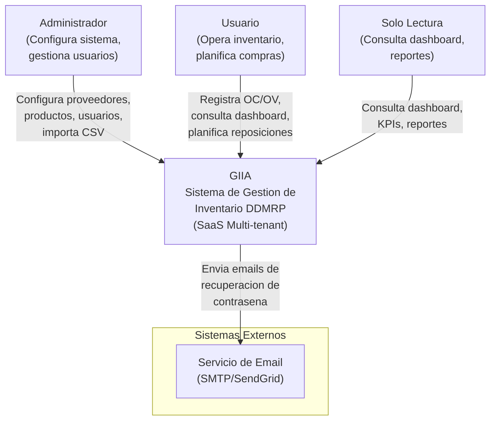
```mermaid
graph TB
    subgraph ext["Sistemas Externos"]
        EMAIL["Servicio de Email<br/>(SMTP/SendGrid)"]
    end

    ADMIN["Administrador<br/>(Configura sistema,<br/>gestiona usuarios)"]
    USER["Usuario<br/>(Opera inventario,<br/>planifica compras)"]
    READONLY["Solo Lectura<br/>(Consulta dashboard,<br/>reportes)"]

    GIIA["GIIA<br/>Sistema de Gestion de<br/>Inventario DDMRP<br/>(SaaS Multi-tenant)"]

    ADMIN -->|"Configura proveedores,<br/>productos, usuarios,<br/>importa CSV"| GIIA
    USER -->|"Registra OC/OV,<br/>consulta dashboard,<br/>planifica reposiciones"| GIIA
    READONLY -->|"Consulta dashboard,<br/>KPIs, reportes"| GIIA
    GIIA -->|"Envia emails de<br/>recuperacion de<br/>contrasena"| EMAIL
```

**Descripcion:** GIIA interactua con tres tipos de usuarios diferenciados por rol (RF-097, RF-098, RF-099) y con un servicio externo de email para recuperacion de contrasena (RF-096). No existen integraciones con ERPs en el MVP.

### 1.6.2 Diagrama C4 - Nivel 2 (Contenedores)

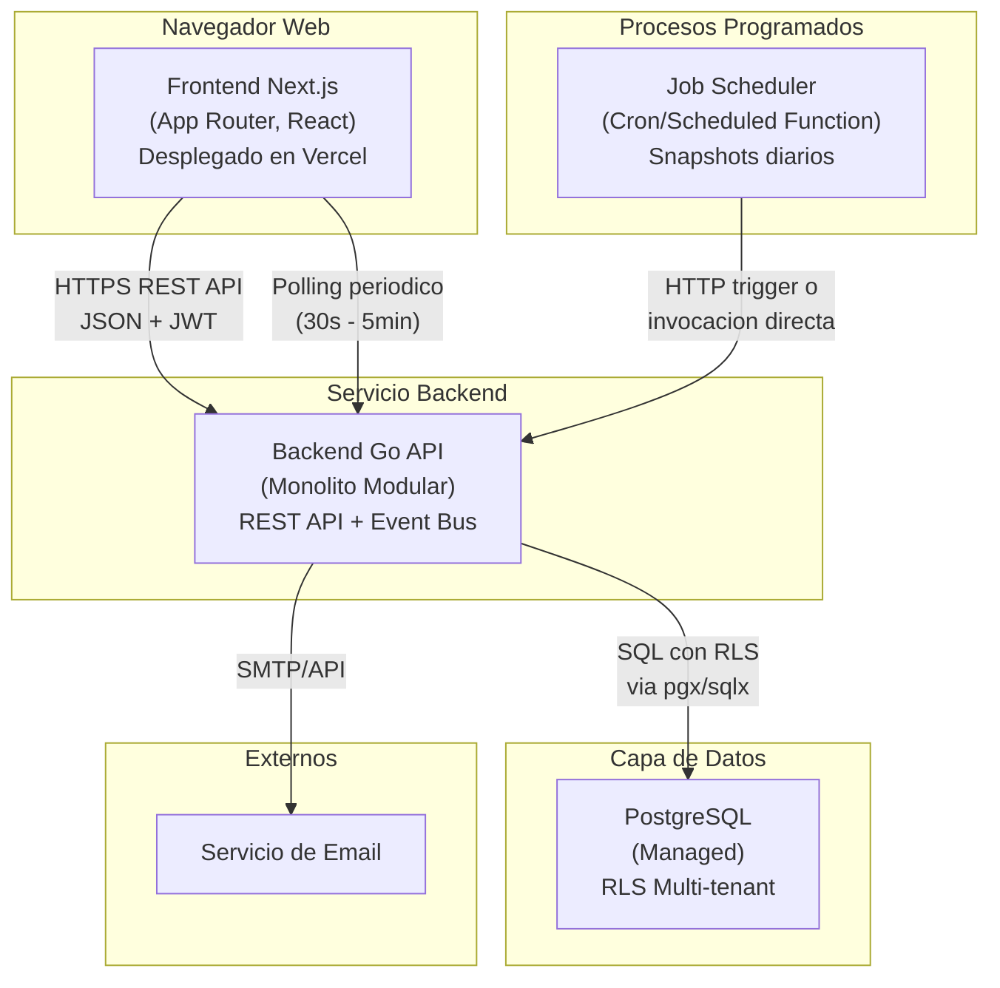
```mermaid
graph TB
    subgraph browser["Navegador Web"]
        FE["Frontend Next.js<br/>(App Router, React)<br/>Desplegado en Vercel"]
    end

    subgraph backend["Servicio Backend"]
        API["Backend Go API<br/>(Monolito Modular)<br/>REST API + Event Bus"]
    end

    subgraph data["Capa de Datos"]
        PG["PostgreSQL<br/>(Managed)<br/>RLS Multi-tenant"]
    end

    subgraph jobs["Procesos Programados"]
        CRON["Job Scheduler<br/>(Cron/Scheduled Function)<br/>Snapshots diarios"]
    end

    subgraph ext["Externos"]
        EMAIL["Servicio de Email"]
    end

    FE -->|"HTTPS REST API<br/>JSON + JWT"| API
    FE -->|"Polling periodico<br/>(30s - 5min)"| API
    API -->|"SQL con RLS<br/>via pgx/sqlx"| PG
    CRON -->|"HTTP trigger o<br/>invocacion directa"| API
    API -->|"SMTP/API"| EMAIL
```

**Descripcion:** Cuatro contenedores principales: (1) Frontend Next.js en Vercel sirve la SPA y realiza polling al backend. (2) Backend Go expone REST API, contiene el event bus interno y toda la logica de negocio. (3) PostgreSQL managed almacena todos los datos con RLS. (4) Job Scheduler dispara snapshots diarios de KPIs y estado de buffers (RF-079 a RF-085).

### 1.6.3 Diagrama C4 - Nivel 3 (Componentes del Backend)

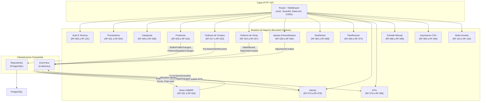
```mermaid
graph TB
    subgraph api_layer["Capa HTTP / API"]
        ROUTER["Router + Middleware<br/>(Auth, TenantID, RateLimit, CORS)"]
    end

    subgraph modules["Modulos de Negocio (Bounded Contexts)"]
        AUTH["Auth & Tenancy<br/>(RF-095 a RF-101)"]
        SUPPLIERS["Proveedores<br/>(RF-001 a RF-004)"]
        CATEGORIES["Categorias<br/>(RF-005 a RF-008)"]
        PRODUCTS["Productos<br/>(RF-009 a RF-016)"]
        PO["Ordenes de Compra<br/>(RF-017 a RF-023)"]
        SO["Ordenes de Venta<br/>(RF-024 a RF-027)"]
        ADJ["Ajustes Extraordinarios<br/>(RF-028 a RF-030)"]
        DDMRP["Motor DDMRP<br/>(RF-031 a RF-062)"]
        DASHBOARD["Dashboard<br/>(RF-063 a RF-068)"]
        PLANNING["Planificacion<br/>(RF-069 a RF-072)"]
        ALERTS["Alertas<br/>(RF-073 a RF-078)"]
        KPIS["KPIs<br/>(RF-079 a RF-085)"]
        INPUT["Entrada Manual<br/>(RF-086 a RF-089)"]
        CSVIMPORT["Importacion CSV<br/>(RF-090 a RF-094)"]
        CURRENCY["Multi-moneda<br/>(RF-102 a RF-105)"]
    end

    subgraph infra["Infraestructura Compartida"]
        EB["Event Bus<br/>(In-Memory)"]
        REPO["Repositories<br/>(PostgreSQL)"]
    end

    ROUTER --> AUTH
    ROUTER --> SUPPLIERS
    ROUTER --> CATEGORIES
    ROUTER --> PRODUCTS
    ROUTER --> PO
    ROUTER --> SO
    ROUTER --> ADJ
    ROUTER --> DASHBOARD
    ROUTER --> PLANNING
    ROUTER --> ALERTS
    ROUTER --> KPIS
    ROUTER --> INPUT
    ROUTER --> CSVIMPORT
    ROUTER --> CURRENCY

    PO -->|"PurchaseOrderReceived"| EB
    SO -->|"SaleEffected,<br/>SaleOrderCreated"| EB
    ADJ -->|"AdjustmentCreated"| EB
    PRODUCTS -->|"BufferProfileChanged,<br/>PreferredSupplierChanged"| EB

    EB -->|"Recalcula CPD,<br/>Zonas, Flujo Neto"| DDMRP
    EB -->|"Evalua alertas"| ALERTS
    EB -->|"Actualiza KPIs"| KPIS

    DDMRP -->|"SuggestionGenerated,<br/>BufferStateChanged"| EB
    EB -->|"Resuelve alertas"| ALERTS

    modules --> REPO
    REPO --> PG["PostgreSQL"]
```

**Descripcion:** El backend se compone de 15 modulos alineados con los bounded contexts del dominio. Los modulos transaccionales (OC, OV, Ajustes) publican eventos al Event Bus. El Motor DDMRP suscribe a estos eventos y ejecuta la cadena de recalculos. Las Alertas reaccionan tanto a eventos transaccionales como a cambios de estado del buffer.

### 1.6.4 Diagrama de Deployment

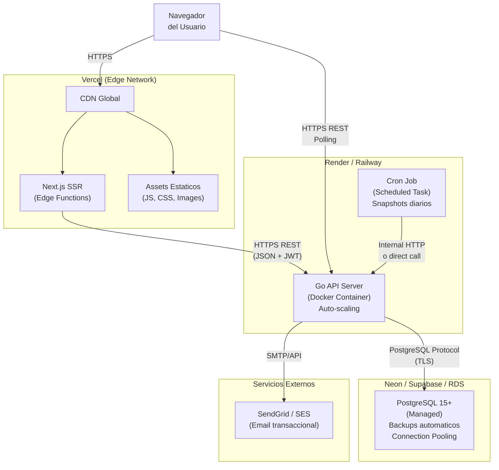
```mermaid
graph TB
    subgraph vercel["Vercel (Edge Network)"]
        CDN["CDN Global"]
        SSR["Next.js SSR<br/>(Edge Functions)"]
        STATIC["Assets Estaticos<br/>(JS, CSS, Images)"]
    end

    subgraph render["Render / Railway"]
        GOAPI["Go API Server<br/>(Docker Container)<br/>Auto-scaling"]
        CRON["Cron Job<br/>(Scheduled Task)<br/>Snapshots diarios"]
    end

    subgraph managed_db["Neon / Supabase / RDS"]
        PG["PostgreSQL 15+<br/>(Managed)<br/>Backups automaticos<br/>Connection Pooling"]
    end

    subgraph external["Servicios Externos"]
        SENDGRID["SendGrid / SES<br/>(Email transaccional)"]
    end

    BROWSER["Navegador<br/>del Usuario"] -->|"HTTPS"| CDN
    CDN --> SSR
    CDN --> STATIC
    SSR -->|"HTTPS REST<br/>(JSON + JWT)"| GOAPI
    BROWSER -->|"HTTPS REST<br/>Polling"| GOAPI
    GOAPI -->|"PostgreSQL Protocol<br/>(TLS)"| PG
    CRON -->|"Internal HTTP<br/>o direct call"| GOAPI
    GOAPI -->|"SMTP/API"| SENDGRID
```

**Descripcion:** El frontend en Vercel sirve assets estaticos via CDN y ejecuta SSR en edge functions. El backend Go se despliega como container en Render/Railway con auto-scaling. PostgreSQL managed (Neon, Supabase, o RDS) provee backups automaticos y connection pooling. Todo el trafico es HTTPS/TLS (RNF-006).

---

# Seccion 2: Modelo de Datos y Entidades

## 2.1 Estrategia de Multi-tenancy: Row-Level Security

**Decision:** Aislamiento por fila con columna `tenant_id` + RLS de PostgreSQL.
**Alternativas consideradas:**
1. Base de datos por tenant -- Descartado por costo de infraestructura y complejidad de migraciones.
2. Schema por tenant -- Descartado por limitaciones de connection pooling y migraciones.
3. Row-level con `tenant_id` + RLS (seleccionado) -- Balanceo optimo entre costo, simplicidad y seguridad (RNF-008, RF-101).

**Implementacion:**
- Todas las tablas de negocio incluyen columna `tenant_id UUID NOT NULL`.
- Al inicio de cada transaccion SQL, el backend ejecuta: `SET LOCAL app.current_tenant_id = '<uuid>'`.
- Las politicas RLS filtran automaticamente por `tenant_id = current_setting('app.current_tenant_id')::uuid`.
- Indice compuesto `(tenant_id, ...)` en todas las tablas como prefijo de cualquier indice.

## 2.2 Estrategia de Soft-Delete

Todas las entidades de datos maestros (proveedores, categorias, productos, usuarios) implementan soft-delete:
- Columna `is_active BOOLEAN NOT NULL DEFAULT TRUE`.
- Las queries de listado filtran por `is_active = TRUE` por defecto.
- Los registros desactivados permanecen para integridad referencial e historico.

Las entidades transaccionales (OC, OV, ajustes) NO usan soft-delete: su ciclo de vida se gestiona por estados (Pendiente, Efectuada, Cancelada).

## 2.3 Estrategia de Auditoria

**Decision:** Columnas de auditoria en cada tabla + tabla de audit log para operaciones de escritura (RNF-009).
**Alternativas consideradas:**
1. Trigger-based audit log -- Mayor overhead por trigger en cada operacion.
2. Application-level audit (seleccionado) -- El backend escribe al audit log explicitamente en cada use case de escritura. Mas control y menor overhead.

Columnas en cada tabla:
```sql
created_at  TIMESTAMPTZ NOT NULL DEFAULT NOW(),
updated_at  TIMESTAMPTZ NOT NULL DEFAULT NOW(),
created_by  UUID REFERENCES users(id),
updated_by  UUID REFERENCES users(id)
```

Tabla `audit_logs` para registro detallado de cambios:
```sql
CREATE TABLE audit_logs (
    id          UUID PRIMARY KEY DEFAULT gen_random_uuid(),
    tenant_id   UUID NOT NULL,
    user_id     UUID NOT NULL,
    action      VARCHAR(20) NOT NULL,  -- CREATE, UPDATE, DELETE, IMPORT
    entity_type VARCHAR(50) NOT NULL,  -- supplier, product, purchase_order, etc.
    entity_id   UUID NOT NULL,
    changes     JSONB,                 -- {field: {old: x, new: y}}
    ip_address  INET,
    created_at  TIMESTAMPTZ NOT NULL DEFAULT NOW()
);
```

## 2.4 Estrategia de Tipos Monetarios

**Decision:** `NUMERIC(15,4)` para todos los campos monetarios.
**Alternativas consideradas:**
1. `DECIMAL(10,2)` -- Insuficiente para escenarios multi-moneda con tipos de cambio fraccionarios.
2. `BIGINT` almacenando centavos -- Requiere conversion constante y no soporta 4 decimales para tipos de cambio.
3. `NUMERIC(15,4)` (seleccionado) -- Soporta hasta 99,999,999,999.9999 sin perdida de precision. 4 decimales permiten tipos de cambio precisos (RF-104).

## 2.5 Estrategia de Persistencia Transaccional

**Decision:** Tabla unica por tipo de transaccion con particionamiento preparado.
**Alternativas consideradas:**
1. Event Sourcing -- Excesiva complejidad para el MVP.
2. Tabla unificada de transacciones -- Schemas muy diferentes entre OC, OV, y ajustes.
3. Tablas separadas por tipo (seleccionado) -- Modelo relacional clasico con indices optimizados. Preparadas para particionamiento por rango de fecha (`created_at`) cuando el volumen lo justifique.

Las 4 tablas transaccionales que mas creceran son:
- `purchase_orders` + `purchase_order_lines`
- `sales_orders` + `sales_order_lines`
- `extraordinary_movements`
- `inventory_transactions` (log consolidado de todos los movimientos de inventario)

Cada tabla incluye indice en `(tenant_id, created_at DESC)` para consultas temporales eficientes.

## 2.6 Schema Completo de PostgreSQL

### Dominio de Datos Maestros

```sql
-- Tenants
CREATE TABLE tenants (
    id              UUID PRIMARY KEY DEFAULT gen_random_uuid(),
    name            VARCHAR(200) NOT NULL,
    slug            VARCHAR(100) NOT NULL UNIQUE,
    base_currency   VARCHAR(3) NOT NULL DEFAULT 'USD',
    local_currency  VARCHAR(3) NOT NULL DEFAULT 'MXN',
    exchange_rate   NUMERIC(15,4) NOT NULL DEFAULT 1.0000,
    cpd_window_days INTEGER NOT NULL DEFAULT 7,
    spike_threshold_pct NUMERIC(5,2) NOT NULL DEFAULT 50.00,
    lt_short_max_days   INTEGER NOT NULL DEFAULT 5,
    lt_medium_max_days  INTEGER NOT NULL DEFAULT 15,
    alert_days_before_arrival INTEGER NOT NULL DEFAULT 3,
    immobilized_criteria VARCHAR(50) NOT NULL DEFAULT 'last_2_po',
    is_active       BOOLEAN NOT NULL DEFAULT TRUE,
    created_at      TIMESTAMPTZ NOT NULL DEFAULT NOW(),
    updated_at      TIMESTAMPTZ NOT NULL DEFAULT NOW()
);

-- Users
CREATE TABLE users (
    id              UUID PRIMARY KEY DEFAULT gen_random_uuid(),
    tenant_id       UUID NOT NULL REFERENCES tenants(id),
    email           VARCHAR(255) NOT NULL,
    password_hash   VARCHAR(255) NOT NULL,
    full_name       VARCHAR(200) NOT NULL,
    role            VARCHAR(20) NOT NULL CHECK (role IN ('admin', 'user', 'readonly')),
    is_active       BOOLEAN NOT NULL DEFAULT TRUE,
    last_login_at   TIMESTAMPTZ,
    created_at      TIMESTAMPTZ NOT NULL DEFAULT NOW(),
    updated_at      TIMESTAMPTZ NOT NULL DEFAULT NOW(),
    created_by      UUID REFERENCES users(id),
    updated_by      UUID REFERENCES users(id),
    UNIQUE(tenant_id, email)
);

-- Suppliers
CREATE TABLE suppliers (
    id              UUID PRIMARY KEY DEFAULT gen_random_uuid(),
    tenant_id       UUID NOT NULL REFERENCES tenants(id),
    business_name   VARCHAR(300) NOT NULL,
    lead_time_days  INTEGER NOT NULL CHECK (lead_time_days > 0),
    location        VARCHAR(300),
    contact_name    VARCHAR(200),
    contact_phone   VARCHAR(50),
    contact_email   VARCHAR(255),
    default_currency VARCHAR(3) NOT NULL DEFAULT 'USD',
    is_active       BOOLEAN NOT NULL DEFAULT TRUE,
    created_at      TIMESTAMPTZ NOT NULL DEFAULT NOW(),
    updated_at      TIMESTAMPTZ NOT NULL DEFAULT NOW(),
    created_by      UUID REFERENCES users(id),
    updated_by      UUID REFERENCES users(id)
);
CREATE INDEX idx_suppliers_tenant_active ON suppliers(tenant_id, is_active);
CREATE INDEX idx_suppliers_tenant_name ON suppliers(tenant_id, business_name);

-- Categories (hierarchical)
CREATE TABLE categories (
    id              UUID PRIMARY KEY DEFAULT gen_random_uuid(),
    tenant_id       UUID NOT NULL REFERENCES tenants(id),
    name            VARCHAR(200) NOT NULL,
    description     TEXT,
    parent_id       UUID REFERENCES categories(id),
    path            TEXT NOT NULL DEFAULT '',  -- materialized path: '/root-id/child-id/'
    depth           INTEGER NOT NULL DEFAULT 0,
    is_active       BOOLEAN NOT NULL DEFAULT TRUE,
    created_at      TIMESTAMPTZ NOT NULL DEFAULT NOW(),
    updated_at      TIMESTAMPTZ NOT NULL DEFAULT NOW(),
    created_by      UUID REFERENCES users(id),
    updated_by      UUID REFERENCES users(id)
);
CREATE INDEX idx_categories_tenant ON categories(tenant_id);
CREATE INDEX idx_categories_parent ON categories(tenant_id, parent_id);
CREATE INDEX idx_categories_path ON categories(tenant_id, path);

-- Products
CREATE TABLE products (
    id              UUID PRIMARY KEY DEFAULT gen_random_uuid(),
    tenant_id       UUID NOT NULL REFERENCES tenants(id),
    sku             VARCHAR(100) NOT NULL,
    name            VARCHAR(300) NOT NULL,
    description     TEXT,
    category_id     UUID REFERENCES categories(id),
    unit_cost       NUMERIC(15,4) NOT NULL DEFAULT 0,
    cost_currency   VARCHAR(3) NOT NULL DEFAULT 'USD',
    unit_of_measure VARCHAR(50) NOT NULL DEFAULT 'unidad',
    lot_number      VARCHAR(100),
    entry_date      DATE,
    expiry_date     DATE,
    image_url       VARCHAR(500),
    cpd_manual      NUMERIC(10,4),  -- CPD manual para productos nuevos
    is_active       BOOLEAN NOT NULL DEFAULT TRUE,
    created_at      TIMESTAMPTZ NOT NULL DEFAULT NOW(),
    updated_at      TIMESTAMPTZ NOT NULL DEFAULT NOW(),
    created_by      UUID REFERENCES users(id),
    updated_by      UUID REFERENCES users(id),
    UNIQUE(tenant_id, sku)
);
CREATE INDEX idx_products_tenant_active ON products(tenant_id, is_active);
CREATE INDEX idx_products_tenant_category ON products(tenant_id, category_id);
CREATE INDEX idx_products_tenant_sku ON products(tenant_id, sku);
CREATE INDEX idx_products_tenant_name ON products(tenant_id, name);

-- Product-Supplier relationship (many-to-many with attributes)
CREATE TABLE product_suppliers (
    id                  UUID PRIMARY KEY DEFAULT gen_random_uuid(),
    tenant_id           UUID NOT NULL REFERENCES tenants(id),
    product_id          UUID NOT NULL REFERENCES products(id) ON DELETE CASCADE,
    supplier_id         UUID NOT NULL REFERENCES suppliers(id),
    lead_time_days      INTEGER NOT NULL CHECK (lead_time_days > 0),
    moq                 INTEGER NOT NULL DEFAULT 1 CHECK (moq > 0),
    order_frequency_days INTEGER NOT NULL DEFAULT 1 CHECK (order_frequency_days > 0),
    is_preferred        BOOLEAN NOT NULL DEFAULT FALSE,
    cost_per_unit       NUMERIC(15,4),
    cost_currency       VARCHAR(3) DEFAULT 'USD',
    created_at          TIMESTAMPTZ NOT NULL DEFAULT NOW(),
    updated_at          TIMESTAMPTZ NOT NULL DEFAULT NOW(),
    UNIQUE(tenant_id, product_id, supplier_id)
);
CREATE INDEX idx_product_suppliers_product ON product_suppliers(tenant_id, product_id);
CREATE INDEX idx_product_suppliers_supplier ON product_suppliers(tenant_id, supplier_id);

-- Buffer Profiles (1:1 with Product)
CREATE TABLE buffer_profiles (
    id                      UUID PRIMARY KEY DEFAULT gen_random_uuid(),
    tenant_id               UUID NOT NULL REFERENCES tenants(id),
    product_id              UUID NOT NULL REFERENCES products(id) ON DELETE CASCADE,
    lt_category             VARCHAR(10) NOT NULL CHECK (lt_category IN ('short', 'medium', 'long')),
    lt_factor               NUMERIC(5,4) NOT NULL DEFAULT 0.3500 CHECK (lt_factor > 0),
    variability_factor      NUMERIC(5,4) NOT NULL DEFAULT 0.2500 CHECK (variability_factor >= 0),
    created_at              TIMESTAMPTZ NOT NULL DEFAULT NOW(),
    updated_at              TIMESTAMPTZ NOT NULL DEFAULT NOW(),
    created_by              UUID REFERENCES users(id),
    updated_by              UUID REFERENCES users(id),
    UNIQUE(tenant_id, product_id)
);
CREATE INDEX idx_buffer_profiles_product ON buffer_profiles(tenant_id, product_id);
```

### Dominio Transaccional

```sql
-- Purchase Orders
CREATE TABLE purchase_orders (
    id                  UUID PRIMARY KEY DEFAULT gen_random_uuid(),
    tenant_id           UUID NOT NULL REFERENCES tenants(id),
    order_number        VARCHAR(50) NOT NULL,
    supplier_id         UUID NOT NULL REFERENCES suppliers(id),
    status              VARCHAR(30) NOT NULL DEFAULT 'pending'
                        CHECK (status IN ('pending', 'partially_received', 'received', 'cancelled')),
    currency            VARCHAR(3) NOT NULL DEFAULT 'USD',
    issue_date          DATE NOT NULL,
    estimated_arrival   DATE NOT NULL,
    actual_arrival      DATE,
    cancellation_reason TEXT,
    notes               TEXT,
    created_at          TIMESTAMPTZ NOT NULL DEFAULT NOW(),
    updated_at          TIMESTAMPTZ NOT NULL DEFAULT NOW(),
    created_by          UUID REFERENCES users(id),
    updated_by          UUID REFERENCES users(id),
    UNIQUE(tenant_id, order_number)
);
CREATE INDEX idx_po_tenant_status ON purchase_orders(tenant_id, status);
CREATE INDEX idx_po_tenant_supplier ON purchase_orders(tenant_id, supplier_id);
CREATE INDEX idx_po_tenant_dates ON purchase_orders(tenant_id, estimated_arrival);
CREATE INDEX idx_po_tenant_created ON purchase_orders(tenant_id, created_at DESC);

-- Purchase Order Lines
CREATE TABLE purchase_order_lines (
    id                  UUID PRIMARY KEY DEFAULT gen_random_uuid(),
    tenant_id           UUID NOT NULL REFERENCES tenants(id),
    purchase_order_id   UUID NOT NULL REFERENCES purchase_orders(id) ON DELETE CASCADE,
    product_id          UUID NOT NULL REFERENCES products(id),
    quantity_ordered    INTEGER NOT NULL CHECK (quantity_ordered > 0),
    quantity_received   INTEGER NOT NULL DEFAULT 0 CHECK (quantity_received >= 0),
    unit_cost           NUMERIC(15,4) NOT NULL,
    created_at          TIMESTAMPTZ NOT NULL DEFAULT NOW(),
    updated_at          TIMESTAMPTZ NOT NULL DEFAULT NOW()
);
CREATE INDEX idx_po_lines_po ON purchase_order_lines(tenant_id, purchase_order_id);
CREATE INDEX idx_po_lines_product ON purchase_order_lines(tenant_id, product_id);

-- Sales Orders
CREATE TABLE sales_orders (
    id                  UUID PRIMARY KEY DEFAULT gen_random_uuid(),
    tenant_id           UUID NOT NULL REFERENCES tenants(id),
    order_number        VARCHAR(50) NOT NULL,
    client_name         VARCHAR(300),  -- opcional en MVP
    status              VARCHAR(30) NOT NULL DEFAULT 'confirmed'
                        CHECK (status IN ('confirmed', 'effected', 'cancelled')),
    currency            VARCHAR(3) NOT NULL DEFAULT 'USD',
    order_date          DATE NOT NULL,
    due_date            DATE,
    cancellation_reason TEXT,
    notes               TEXT,
    created_at          TIMESTAMPTZ NOT NULL DEFAULT NOW(),
    updated_at          TIMESTAMPTZ NOT NULL DEFAULT NOW(),
    created_by          UUID REFERENCES users(id),
    updated_by          UUID REFERENCES users(id),
    UNIQUE(tenant_id, order_number)
);
CREATE INDEX idx_so_tenant_status ON sales_orders(tenant_id, status);
CREATE INDEX idx_so_tenant_dates ON sales_orders(tenant_id, due_date);
CREATE INDEX idx_so_tenant_created ON sales_orders(tenant_id, created_at DESC);

-- Sales Order Lines
CREATE TABLE sales_order_lines (
    id                  UUID PRIMARY KEY DEFAULT gen_random_uuid(),
    tenant_id           UUID NOT NULL REFERENCES tenants(id),
    sales_order_id      UUID NOT NULL REFERENCES sales_orders(id) ON DELETE CASCADE,
    product_id          UUID NOT NULL REFERENCES products(id),
    quantity            INTEGER NOT NULL CHECK (quantity > 0),
    unit_price          NUMERIC(15,4) NOT NULL,
    quantity_delivered   INTEGER NOT NULL DEFAULT 0 CHECK (quantity_delivered >= 0),
    created_at          TIMESTAMPTZ NOT NULL DEFAULT NOW(),
    updated_at          TIMESTAMPTZ NOT NULL DEFAULT NOW()
);
CREATE INDEX idx_so_lines_so ON sales_order_lines(tenant_id, sales_order_id);
CREATE INDEX idx_so_lines_product ON sales_order_lines(tenant_id, product_id);

-- Extraordinary Movements
CREATE TABLE extraordinary_movements (
    id                  UUID PRIMARY KEY DEFAULT gen_random_uuid(),
    tenant_id           UUID NOT NULL REFERENCES tenants(id),
    product_id          UUID NOT NULL REFERENCES products(id),
    direction           VARCHAR(10) NOT NULL CHECK (direction IN ('inbound', 'outbound')),
    movement_type       VARCHAR(30) NOT NULL,
    -- inbound: return, positive_adjustment, transfer_in
    -- outbound: loss, shrinkage, obsolescence, negative_adjustment, sample
    quantity            INTEGER NOT NULL CHECK (quantity > 0),
    justification       TEXT NOT NULL,
    batch_id            UUID,  -- para agrupar ajustes del mismo conteo fisico
    created_at          TIMESTAMPTZ NOT NULL DEFAULT NOW(),
    created_by          UUID REFERENCES users(id)
);
CREATE INDEX idx_extmov_tenant_product ON extraordinary_movements(tenant_id, product_id);
CREATE INDEX idx_extmov_tenant_created ON extraordinary_movements(tenant_id, created_at DESC);
CREATE INDEX idx_extmov_tenant_type ON extraordinary_movements(tenant_id, direction, movement_type);

-- Inventory Transactions (consolidated log of ALL inventory movements)
CREATE TABLE inventory_transactions (
    id                  UUID PRIMARY KEY DEFAULT gen_random_uuid(),
    tenant_id           UUID NOT NULL REFERENCES tenants(id),
    product_id          UUID NOT NULL REFERENCES products(id),
    transaction_type    VARCHAR(30) NOT NULL,
    -- po_receipt, so_delivery, adjustment_in, adjustment_out
    direction           VARCHAR(10) NOT NULL CHECK (direction IN ('inbound', 'outbound')),
    quantity            INTEGER NOT NULL CHECK (quantity > 0),
    reference_type      VARCHAR(30),  -- purchase_order, sales_order, extraordinary_movement
    reference_id        UUID,
    running_balance     INTEGER NOT NULL DEFAULT 0,  -- saldo acumulado post-transaccion
    transaction_date    DATE NOT NULL,
    created_at          TIMESTAMPTZ NOT NULL DEFAULT NOW(),
    created_by          UUID REFERENCES users(id)
);
CREATE INDEX idx_invtx_tenant_product_date ON inventory_transactions(tenant_id, product_id, transaction_date DESC);
CREATE INDEX idx_invtx_tenant_date ON inventory_transactions(tenant_id, transaction_date DESC);
CREATE INDEX idx_invtx_tenant_type ON inventory_transactions(tenant_id, transaction_type);
```

### Dominio DDMRP

```sql
-- Precalculated buffer/flow state per product (updated on each event)
CREATE TABLE product_buffer_state (
    id                      UUID PRIMARY KEY DEFAULT gen_random_uuid(),
    tenant_id               UUID NOT NULL REFERENCES tenants(id),
    product_id              UUID NOT NULL REFERENCES products(id) ON DELETE CASCADE,
    cpd                     NUMERIC(10,4) NOT NULL DEFAULT 0,
    lead_time_days          INTEGER NOT NULL DEFAULT 0,
    moq                     INTEGER NOT NULL DEFAULT 1,
    order_frequency_days    INTEGER NOT NULL DEFAULT 1,
    lt_factor               NUMERIC(5,4) NOT NULL DEFAULT 0.35,
    variability_factor      NUMERIC(5,4) NOT NULL DEFAULT 0.25,
    -- Calculated zones
    red_zone_base           NUMERIC(10,2) NOT NULL DEFAULT 0,
    red_zone_safety         NUMERIC(10,2) NOT NULL DEFAULT 0,
    red_zone_total          NUMERIC(10,2) NOT NULL DEFAULT 0,
    yellow_zone             NUMERIC(10,2) NOT NULL DEFAULT 0,
    green_zone              NUMERIC(10,2) NOT NULL DEFAULT 0,
    tog                     NUMERIC(10,2) NOT NULL DEFAULT 0,
    -- Flow equation
    physical_inventory      INTEGER NOT NULL DEFAULT 0,
    in_transit_inventory    INTEGER NOT NULL DEFAULT 0,
    qualified_demand        INTEGER NOT NULL DEFAULT 0,
    net_flow                NUMERIC(10,2) NOT NULL DEFAULT 0,
    -- Buffer status
    buffer_status           VARCHAR(20) NOT NULL DEFAULT 'green'
                            CHECK (buffer_status IN ('red_safety', 'red_base', 'yellow', 'green')),
    penetration_pct         NUMERIC(5,2) NOT NULL DEFAULT 0,  -- % de penetracion en zona roja
    -- Suggestion
    suggested_quantity      INTEGER NOT NULL DEFAULT 0,
    suggested_supplier_id   UUID REFERENCES suppliers(id),
    -- Active dynamic adjustments
    fad_value               NUMERIC(5,4) NOT NULL DEFAULT 1.0000,
    faz_value               NUMERIC(5,4) NOT NULL DEFAULT 1.0000,
    faltd_value             NUMERIC(5,4) NOT NULL DEFAULT 1.0000,
    -- Timestamps
    last_cpd_calc_at        TIMESTAMPTZ,
    last_zone_calc_at       TIMESTAMPTZ,
    last_flow_calc_at       TIMESTAMPTZ,
    updated_at              TIMESTAMPTZ NOT NULL DEFAULT NOW(),
    UNIQUE(tenant_id, product_id)
);
CREATE INDEX idx_pbs_tenant_status ON product_buffer_state(tenant_id, buffer_status);
CREATE INDEX idx_pbs_tenant_penetration ON product_buffer_state(tenant_id, penetration_pct DESC);

-- CPD History (daily snapshots)
CREATE TABLE cpd_history (
    id              UUID PRIMARY KEY DEFAULT gen_random_uuid(),
    tenant_id       UUID NOT NULL REFERENCES tenants(id),
    product_id      UUID NOT NULL REFERENCES products(id) ON DELETE CASCADE,
    calc_date       DATE NOT NULL,
    cpd_value       NUMERIC(10,4) NOT NULL,
    window_days     INTEGER NOT NULL,
    total_consumed  INTEGER NOT NULL,
    source          VARCHAR(20) NOT NULL DEFAULT 'calculated'
                    CHECK (source IN ('calculated', 'manual')),
    created_at      TIMESTAMPTZ NOT NULL DEFAULT NOW()
);
CREATE INDEX idx_cpd_history_product_date ON cpd_history(tenant_id, product_id, calc_date DESC);

-- Dynamic Adjustments
CREATE TABLE dynamic_adjustments (
    id              UUID PRIMARY KEY DEFAULT gen_random_uuid(),
    tenant_id       UUID NOT NULL REFERENCES tenants(id),
    product_id      UUID NOT NULL REFERENCES products(id) ON DELETE CASCADE,
    adjustment_type VARCHAR(10) NOT NULL CHECK (adjustment_type IN ('fad', 'faz', 'faltd')),
    factor_value    NUMERIC(5,4) NOT NULL CHECK (factor_value > 0),
    target_zone     VARCHAR(10),  -- solo para FAZ: 'red', 'yellow', 'green', o NULL para todas
    start_date      DATE NOT NULL,
    end_date        DATE,  -- NULL = indefinido
    is_active       BOOLEAN NOT NULL DEFAULT TRUE,
    created_at      TIMESTAMPTZ NOT NULL DEFAULT NOW(),
    created_by      UUID REFERENCES users(id)
);
CREATE INDEX idx_dyn_adj_product ON dynamic_adjustments(tenant_id, product_id, is_active);
CREATE INDEX idx_dyn_adj_dates ON dynamic_adjustments(tenant_id, start_date, end_date);

-- Replenishment Suggestions
CREATE TABLE replenishment_suggestions (
    id                  UUID PRIMARY KEY DEFAULT gen_random_uuid(),
    tenant_id           UUID NOT NULL REFERENCES tenants(id),
    product_id          UUID NOT NULL REFERENCES products(id),
    supplier_id         UUID REFERENCES suppliers(id),
    suggested_quantity  INTEGER NOT NULL CHECK (suggested_quantity > 0),
    net_flow_at_calc    NUMERIC(10,2) NOT NULL,
    tog_at_calc         NUMERIC(10,2) NOT NULL,
    priority_score      NUMERIC(5,2) NOT NULL DEFAULT 0,  -- 0-100, mayor = mas urgente
    buffer_status       VARCHAR(20) NOT NULL,
    status              VARCHAR(20) NOT NULL DEFAULT 'active'
                        CHECK (status IN ('active', 'converted', 'dismissed', 'expired')),
    converted_to_po_id  UUID REFERENCES purchase_orders(id),
    created_at          TIMESTAMPTZ NOT NULL DEFAULT NOW(),
    updated_at          TIMESTAMPTZ NOT NULL DEFAULT NOW()
);
CREATE INDEX idx_suggestions_tenant_status ON replenishment_suggestions(tenant_id, status);
CREATE INDEX idx_suggestions_tenant_priority ON replenishment_suggestions(tenant_id, priority_score DESC);
CREATE INDEX idx_suggestions_tenant_supplier ON replenishment_suggestions(tenant_id, supplier_id);
```

### Dominio de Soporte

```sql
-- Alerts
CREATE TABLE alerts (
    id              UUID PRIMARY KEY DEFAULT gen_random_uuid(),
    tenant_id       UUID NOT NULL REFERENCES tenants(id),
    alert_type      VARCHAR(30) NOT NULL,
    -- buffer_red, buffer_yellow, arrival_soon, arrival_overdue, lt_deviation, deficit_severe
    severity        VARCHAR(10) NOT NULL CHECK (severity IN ('low', 'medium', 'high', 'critical')),
    title           VARCHAR(300) NOT NULL,
    message         TEXT NOT NULL,
    reference_type  VARCHAR(30),  -- product, purchase_order
    reference_id    UUID,
    is_read         BOOLEAN NOT NULL DEFAULT FALSE,
    is_resolved     BOOLEAN NOT NULL DEFAULT FALSE,
    resolved_at     TIMESTAMPTZ,
    resolved_reason VARCHAR(50),  -- manual, auto_resolved
    created_at      TIMESTAMPTZ NOT NULL DEFAULT NOW(),
    read_at         TIMESTAMPTZ
);
CREATE INDEX idx_alerts_tenant_unread ON alerts(tenant_id, is_read, created_at DESC);
CREATE INDEX idx_alerts_tenant_type ON alerts(tenant_id, alert_type);
CREATE INDEX idx_alerts_tenant_ref ON alerts(tenant_id, reference_type, reference_id);

-- KPI Snapshots (daily)
CREATE TABLE kpi_snapshots (
    id                          UUID PRIMARY KEY DEFAULT gen_random_uuid(),
    tenant_id                   UUID NOT NULL REFERENCES tenants(id),
    snapshot_date               DATE NOT NULL,
    total_inventory_cost        NUMERIC(15,4) NOT NULL DEFAULT 0,
    total_inventory_cost_currency VARCHAR(3) NOT NULL DEFAULT 'USD',
    days_in_inventory_avg       NUMERIC(10,2) NOT NULL DEFAULT 0,
    immobilized_inventory_value NUMERIC(15,4) NOT NULL DEFAULT 0,
    immobilized_inventory_pct   NUMERIC(5,2) NOT NULL DEFAULT 0,
    inventory_turnover          NUMERIC(10,4) NOT NULL DEFAULT 0,
    total_skus                  INTEGER NOT NULL DEFAULT 0,
    skus_in_red                 INTEGER NOT NULL DEFAULT 0,
    skus_in_yellow              INTEGER NOT NULL DEFAULT 0,
    skus_in_green               INTEGER NOT NULL DEFAULT 0,
    created_at                  TIMESTAMPTZ NOT NULL DEFAULT NOW(),
    UNIQUE(tenant_id, snapshot_date)
);
CREATE INDEX idx_kpi_snapshots_tenant_date ON kpi_snapshots(tenant_id, snapshot_date DESC);

-- Buffer State Snapshots (daily per product)
CREATE TABLE buffer_snapshots (
    id                  UUID PRIMARY KEY DEFAULT gen_random_uuid(),
    tenant_id           UUID NOT NULL REFERENCES tenants(id),
    product_id          UUID NOT NULL REFERENCES products(id),
    snapshot_date       DATE NOT NULL,
    cpd                 NUMERIC(10,4) NOT NULL,
    red_zone_total      NUMERIC(10,2) NOT NULL,
    yellow_zone         NUMERIC(10,2) NOT NULL,
    green_zone          NUMERIC(10,2) NOT NULL,
    tog                 NUMERIC(10,2) NOT NULL,
    physical_inventory  INTEGER NOT NULL,
    in_transit          INTEGER NOT NULL,
    qualified_demand    INTEGER NOT NULL,
    net_flow            NUMERIC(10,2) NOT NULL,
    buffer_status       VARCHAR(20) NOT NULL,
    created_at          TIMESTAMPTZ NOT NULL DEFAULT NOW(),
    UNIQUE(tenant_id, product_id, snapshot_date)
);
CREATE INDEX idx_buffer_snap_tenant_date ON buffer_snapshots(tenant_id, snapshot_date DESC);
CREATE INDEX idx_buffer_snap_product_date ON buffer_snapshots(tenant_id, product_id, snapshot_date DESC);

-- Import Logs
CREATE TABLE import_logs (
    id                  UUID PRIMARY KEY DEFAULT gen_random_uuid(),
    tenant_id           UUID NOT NULL REFERENCES tenants(id),
    import_type         VARCHAR(30) NOT NULL, -- products, suppliers, sales_history, purchase_history
    file_name           VARCHAR(300) NOT NULL,
    file_size_bytes     BIGINT,
    status              VARCHAR(20) NOT NULL DEFAULT 'processing'
                        CHECK (status IN ('processing', 'completed', 'failed', 'partial')),
    total_rows          INTEGER NOT NULL DEFAULT 0,
    valid_rows          INTEGER NOT NULL DEFAULT 0,
    error_rows          INTEGER NOT NULL DEFAULT 0,
    errors_detail       JSONB,  -- [{row: 5, field: "sku", error: "duplicate"}]
    column_mapping      JSONB,  -- {csv_col: system_field}
    started_at          TIMESTAMPTZ NOT NULL DEFAULT NOW(),
    completed_at        TIMESTAMPTZ,
    created_by          UUID REFERENCES users(id)
);
CREATE INDEX idx_import_logs_tenant ON import_logs(tenant_id, started_at DESC);

-- System Config (per tenant overrides)
CREATE TABLE system_configs (
    id              UUID PRIMARY KEY DEFAULT gen_random_uuid(),
    tenant_id       UUID NOT NULL REFERENCES tenants(id),
    config_key      VARCHAR(100) NOT NULL,
    config_value    JSONB NOT NULL,
    updated_at      TIMESTAMPTZ NOT NULL DEFAULT NOW(),
    updated_by      UUID REFERENCES users(id),
    UNIQUE(tenant_id, config_key)
);

-- Password Reset Tokens
CREATE TABLE password_reset_tokens (
    id              UUID PRIMARY KEY DEFAULT gen_random_uuid(),
    user_id         UUID NOT NULL REFERENCES users(id),
    token_hash      VARCHAR(255) NOT NULL,
    expires_at      TIMESTAMPTZ NOT NULL,
    used_at         TIMESTAMPTZ,
    created_at      TIMESTAMPTZ NOT NULL DEFAULT NOW()
);
CREATE INDEX idx_prt_user ON password_reset_tokens(user_id);
```

### Politicas RLS

```sql
-- Habilitar RLS en todas las tablas de negocio
ALTER TABLE suppliers ENABLE ROW LEVEL SECURITY;
ALTER TABLE categories ENABLE ROW LEVEL SECURITY;
ALTER TABLE products ENABLE ROW LEVEL SECURITY;
ALTER TABLE product_suppliers ENABLE ROW LEVEL SECURITY;
ALTER TABLE buffer_profiles ENABLE ROW LEVEL SECURITY;
ALTER TABLE purchase_orders ENABLE ROW LEVEL SECURITY;
ALTER TABLE purchase_order_lines ENABLE ROW LEVEL SECURITY;
ALTER TABLE sales_orders ENABLE ROW LEVEL SECURITY;
ALTER TABLE sales_order_lines ENABLE ROW LEVEL SECURITY;
ALTER TABLE extraordinary_movements ENABLE ROW LEVEL SECURITY;
ALTER TABLE inventory_transactions ENABLE ROW LEVEL SECURITY;
ALTER TABLE product_buffer_state ENABLE ROW LEVEL SECURITY;
ALTER TABLE cpd_history ENABLE ROW LEVEL SECURITY;
ALTER TABLE dynamic_adjustments ENABLE ROW LEVEL SECURITY;
ALTER TABLE replenishment_suggestions ENABLE ROW LEVEL SECURITY;
ALTER TABLE alerts ENABLE ROW LEVEL SECURITY;
ALTER TABLE kpi_snapshots ENABLE ROW LEVEL SECURITY;
ALTER TABLE buffer_snapshots ENABLE ROW LEVEL SECURITY;
ALTER TABLE import_logs ENABLE ROW LEVEL SECURITY;
ALTER TABLE audit_logs ENABLE ROW LEVEL SECURITY;
ALTER TABLE system_configs ENABLE ROW LEVEL SECURITY;

-- Politica generica (se aplica a cada tabla)
-- Ejemplo para suppliers:
CREATE POLICY tenant_isolation ON suppliers
    USING (tenant_id = current_setting('app.current_tenant_id')::uuid)
    WITH CHECK (tenant_id = current_setting('app.current_tenant_id')::uuid);

-- Patron identico para todas las tablas con tenant_id
```

## 2.7 Diagramas ER

### 2.7.1 ER - Dominio de Datos Maestros

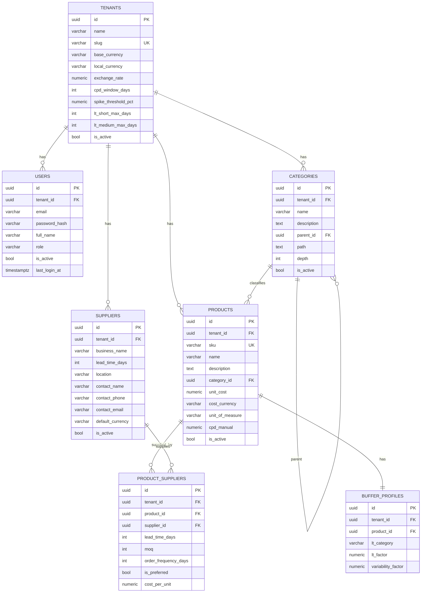
```mermaid
erDiagram
    TENANTS {
        uuid id PK
        varchar name
        varchar slug UK
        varchar base_currency
        varchar local_currency
        numeric exchange_rate
        int cpd_window_days
        numeric spike_threshold_pct
        int lt_short_max_days
        int lt_medium_max_days
        bool is_active
    }

    USERS {
        uuid id PK
        uuid tenant_id FK
        varchar email
        varchar password_hash
        varchar full_name
        varchar role
        bool is_active
        timestamptz last_login_at
    }

    SUPPLIERS {
        uuid id PK
        uuid tenant_id FK
        varchar business_name
        int lead_time_days
        varchar location
        varchar contact_name
        varchar contact_phone
        varchar contact_email
        varchar default_currency
        bool is_active
    }

    CATEGORIES {
        uuid id PK
        uuid tenant_id FK
        varchar name
        text description
        uuid parent_id FK
        text path
        int depth
        bool is_active
    }

    PRODUCTS {
        uuid id PK
        uuid tenant_id FK
        varchar sku UK
        varchar name
        text description
        uuid category_id FK
        numeric unit_cost
        varchar cost_currency
        varchar unit_of_measure
        numeric cpd_manual
        bool is_active
    }

    PRODUCT_SUPPLIERS {
        uuid id PK
        uuid tenant_id FK
        uuid product_id FK
        uuid supplier_id FK
        int lead_time_days
        int moq
        int order_frequency_days
        bool is_preferred
        numeric cost_per_unit
    }

    BUFFER_PROFILES {
        uuid id PK
        uuid tenant_id FK
        uuid product_id FK
        varchar lt_category
        numeric lt_factor
        numeric variability_factor
    }

    TENANTS ||--o{ USERS : "has"
    TENANTS ||--o{ SUPPLIERS : "has"
    TENANTS ||--o{ CATEGORIES : "has"
    TENANTS ||--o{ PRODUCTS : "has"
    CATEGORIES ||--o{ CATEGORIES : "parent"
    CATEGORIES ||--o{ PRODUCTS : "classifies"
    PRODUCTS ||--o{ PRODUCT_SUPPLIERS : "supplied_by"
    SUPPLIERS ||--o{ PRODUCT_SUPPLIERS : "supplies"
    PRODUCTS ||--|| BUFFER_PROFILES : "has"
```

**Descripcion:** El dominio de datos maestros modela las entidades fundamentales del sistema. Cada entidad pertenece a un Tenant (multi-tenancy). Los Productos se clasifican en Categorias jerarquicas (RF-005 a RF-008) y se asocian a multiples Proveedores con atributos especificos por relacion (RF-010). Cada Producto tiene exactamente un Buffer Profile (1:1) segun HU-008.

### 2.7.2 ER - Dominio Transaccional

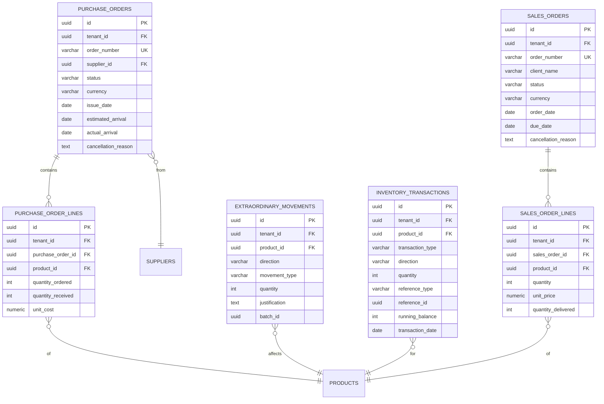
```mermaid
erDiagram
    PURCHASE_ORDERS {
        uuid id PK
        uuid tenant_id FK
        varchar order_number UK
        uuid supplier_id FK
        varchar status
        varchar currency
        date issue_date
        date estimated_arrival
        date actual_arrival
        text cancellation_reason
    }

    PURCHASE_ORDER_LINES {
        uuid id PK
        uuid tenant_id FK
        uuid purchase_order_id FK
        uuid product_id FK
        int quantity_ordered
        int quantity_received
        numeric unit_cost
    }

    SALES_ORDERS {
        uuid id PK
        uuid tenant_id FK
        varchar order_number UK
        varchar client_name
        varchar status
        varchar currency
        date order_date
        date due_date
        text cancellation_reason
    }

    SALES_ORDER_LINES {
        uuid id PK
        uuid tenant_id FK
        uuid sales_order_id FK
        uuid product_id FK
        int quantity
        numeric unit_price
        int quantity_delivered
    }

    EXTRAORDINARY_MOVEMENTS {
        uuid id PK
        uuid tenant_id FK
        uuid product_id FK
        varchar direction
        varchar movement_type
        int quantity
        text justification
        uuid batch_id
    }

    INVENTORY_TRANSACTIONS {
        uuid id PK
        uuid tenant_id FK
        uuid product_id FK
        varchar transaction_type
        varchar direction
        int quantity
        varchar reference_type
        uuid reference_id
        int running_balance
        date transaction_date
    }

    PURCHASE_ORDERS ||--o{ PURCHASE_ORDER_LINES : "contains"
    SALES_ORDERS ||--o{ SALES_ORDER_LINES : "contains"
    PURCHASE_ORDER_LINES }o--|| PRODUCTS : "of"
    SALES_ORDER_LINES }o--|| PRODUCTS : "of"
    EXTRAORDINARY_MOVEMENTS }o--|| PRODUCTS : "affects"
    INVENTORY_TRANSACTIONS }o--|| PRODUCTS : "for"
    PURCHASE_ORDERS }o--|| SUPPLIERS : "from"
```

**Descripcion:** El dominio transaccional captura todas las operaciones que afectan el inventario. Las Ordenes de Compra siguen el ciclo Pendiente -> Parcialmente Recibida -> Recibida / Cancelada (RF-017 a RF-023). Las Ordenes de Venta siguen el ciclo En Firme -> Efectuada / Cancelada (RF-024 a RF-027). Los Movimientos Extraordinarios registran ajustes no regulares (RF-028 a RF-030). La tabla `inventory_transactions` consolida todos los movimientos como log inmutable.

### 2.7.3 ER - Dominio DDMRP

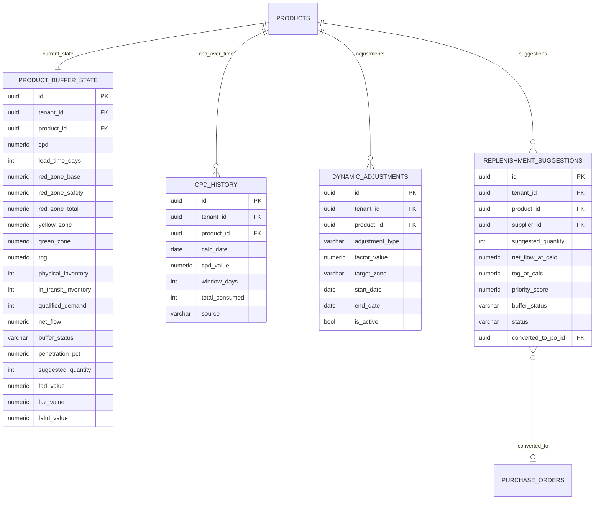
```mermaid
erDiagram
    PRODUCT_BUFFER_STATE {
        uuid id PK
        uuid tenant_id FK
        uuid product_id FK
        numeric cpd
        int lead_time_days
        numeric red_zone_base
        numeric red_zone_safety
        numeric red_zone_total
        numeric yellow_zone
        numeric green_zone
        numeric tog
        int physical_inventory
        int in_transit_inventory
        int qualified_demand
        numeric net_flow
        varchar buffer_status
        numeric penetration_pct
        int suggested_quantity
        numeric fad_value
        numeric faz_value
        numeric faltd_value
    }

    CPD_HISTORY {
        uuid id PK
        uuid tenant_id FK
        uuid product_id FK
        date calc_date
        numeric cpd_value
        int window_days
        int total_consumed
        varchar source
    }

    DYNAMIC_ADJUSTMENTS {
        uuid id PK
        uuid tenant_id FK
        uuid product_id FK
        varchar adjustment_type
        numeric factor_value
        varchar target_zone
        date start_date
        date end_date
        bool is_active
    }

    REPLENISHMENT_SUGGESTIONS {
        uuid id PK
        uuid tenant_id FK
        uuid product_id FK
        uuid supplier_id FK
        int suggested_quantity
        numeric net_flow_at_calc
        numeric tog_at_calc
        numeric priority_score
        varchar buffer_status
        varchar status
        uuid converted_to_po_id FK
    }

    PRODUCTS ||--|| PRODUCT_BUFFER_STATE : "current_state"
    PRODUCTS ||--o{ CPD_HISTORY : "cpd_over_time"
    PRODUCTS ||--o{ DYNAMIC_ADJUSTMENTS : "adjustments"
    PRODUCTS ||--o{ REPLENISHMENT_SUGGESTIONS : "suggestions"
    REPLENISHMENT_SUGGESTIONS }o--o| PURCHASE_ORDERS : "converted_to"
```

**Descripcion:** El dominio DDMRP es el nucleo del sistema. `product_buffer_state` es una tabla precalculada que contiene el estado actual completo de cada producto: CPD, zonas, flujo neto, estado de buffer, y sugerencia vigente. Se actualiza en cada evento relevante (RF-031 a RF-062). `cpd_history` persiste la evolucion historica del CPD. `dynamic_adjustments` almacena los factores FAD/FAZ/FALTD con vigencia temporal (RF-058 a RF-062).

### 2.7.4 ER - Dominio de Soporte

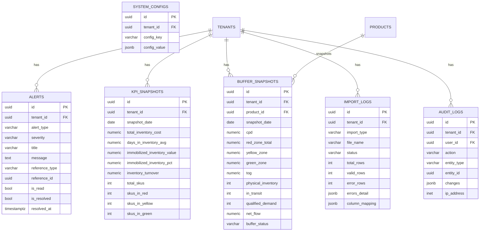
```mermaid
erDiagram
    ALERTS {
        uuid id PK
        uuid tenant_id FK
        varchar alert_type
        varchar severity
        varchar title
        text message
        varchar reference_type
        uuid reference_id
        bool is_read
        bool is_resolved
        timestamptz resolved_at
    }

    KPI_SNAPSHOTS {
        uuid id PK
        uuid tenant_id FK
        date snapshot_date
        numeric total_inventory_cost
        numeric days_in_inventory_avg
        numeric immobilized_inventory_value
        numeric immobilized_inventory_pct
        numeric inventory_turnover
        int total_skus
        int skus_in_red
        int skus_in_yellow
        int skus_in_green
    }

    BUFFER_SNAPSHOTS {
        uuid id PK
        uuid tenant_id FK
        uuid product_id FK
        date snapshot_date
        numeric cpd
        numeric red_zone_total
        numeric yellow_zone
        numeric green_zone
        numeric tog
        int physical_inventory
        int in_transit
        int qualified_demand
        numeric net_flow
        varchar buffer_status
    }

    IMPORT_LOGS {
        uuid id PK
        uuid tenant_id FK
        varchar import_type
        varchar file_name
        varchar status
        int total_rows
        int valid_rows
        int error_rows
        jsonb errors_detail
        jsonb column_mapping
    }

    AUDIT_LOGS {
        uuid id PK
        uuid tenant_id FK
        uuid user_id FK
        varchar action
        varchar entity_type
        uuid entity_id
        jsonb changes
        inet ip_address
    }

    SYSTEM_CONFIGS {
        uuid id PK
        uuid tenant_id FK
        varchar config_key
        jsonb config_value
    }

    TENANTS ||--o{ ALERTS : "has"
    TENANTS ||--o{ KPI_SNAPSHOTS : "has"
    TENANTS ||--o{ BUFFER_SNAPSHOTS : "has"
    TENANTS ||--o{ IMPORT_LOGS : "has"
    TENANTS ||--o{ AUDIT_LOGS : "has"
    PRODUCTS ||--o{ BUFFER_SNAPSHOTS : "snapshots"
```

**Descripcion:** El dominio de soporte incluye Alertas (RF-073 a RF-078), KPI Snapshots diarios (RF-079 a RF-085), Buffer Snapshots por producto para tendencias (RF-067), logs de importacion CSV (RF-090 a RF-094), y configuracion del sistema.

### 2.7.5 ER Consolidado - Relaciones Cross-Domain

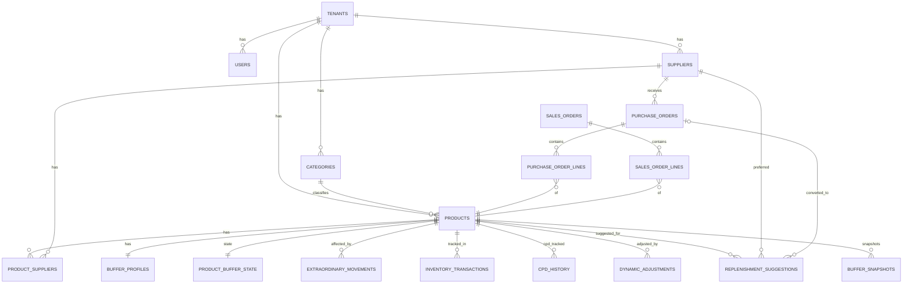
```mermaid
erDiagram
    TENANTS ||--o{ USERS : "has"
    TENANTS ||--o{ SUPPLIERS : "has"
    TENANTS ||--o{ CATEGORIES : "has"
    TENANTS ||--o{ PRODUCTS : "has"

    CATEGORIES ||--o{ PRODUCTS : "classifies"
    PRODUCTS ||--o{ PRODUCT_SUPPLIERS : "has"
    SUPPLIERS ||--o{ PRODUCT_SUPPLIERS : "has"
    PRODUCTS ||--|| BUFFER_PROFILES : "has"
    PRODUCTS ||--|| PRODUCT_BUFFER_STATE : "state"

    SUPPLIERS ||--o{ PURCHASE_ORDERS : "receives"
    PURCHASE_ORDERS ||--o{ PURCHASE_ORDER_LINES : "contains"
    PURCHASE_ORDER_LINES }o--|| PRODUCTS : "of"

    SALES_ORDERS ||--o{ SALES_ORDER_LINES : "contains"
    SALES_ORDER_LINES }o--|| PRODUCTS : "of"

    PRODUCTS ||--o{ EXTRAORDINARY_MOVEMENTS : "affected_by"
    PRODUCTS ||--o{ INVENTORY_TRANSACTIONS : "tracked_in"
    PRODUCTS ||--o{ CPD_HISTORY : "cpd_tracked"
    PRODUCTS ||--o{ DYNAMIC_ADJUSTMENTS : "adjusted_by"
    PRODUCTS ||--o{ REPLENISHMENT_SUGGESTIONS : "suggested_for"
    PRODUCTS ||--o{ BUFFER_SNAPSHOTS : "snapshots"

    REPLENISHMENT_SUGGESTIONS }o--o| PURCHASE_ORDERS : "converted_to"
    SUPPLIERS ||--o{ REPLENISHMENT_SUGGESTIONS : "preferred"
```

**Descripcion:** Diagrama consolidado mostrando las relaciones entre los cuatro dominios. Las foreign keys cross-domain mas criticas son: (1) Products -> Categories y Products -> ProductSuppliers que conectan datos maestros. (2) PurchaseOrderLines/SalesOrderLines -> Products que conectan transacciones con datos maestros. (3) ProductBufferState -> Products que conecta DDMRP con datos maestros. (4) ReplenishmentSuggestions -> PurchaseOrders que conecta DDMRP con transacciones.

---

# Seccion 3: Diseno del Motor DDMRP

## 3.1 Arquitectura Interna del Motor

El Motor DDMRP es el modulo mas critico del sistema. Se implementa como un bounded context independiente dentro del monolito Go, con la siguiente estructura interna:

```
internal/ddmrp/
  domain/
    cpd.go              -- Logica de calculo de CPD
    zones.go            -- Logica de calculo de zonas (Roja, Amarilla, Verde, TOG)
    netflow.go          -- Ecuacion de flujo neto
    suggestion.go       -- Generacion de sugerencias de reposicion
    adjustment.go       -- Aplicacion de factores dinamicos FAD/FAZ/FALTD
    events.go           -- Domain events del motor
    values.go           -- Value Objects (ZoneCalculation, FlowResult, etc.)
  application/
    recalculate_cpd.go
    recalculate_zones.go
    recalculate_netflow.go
    evaluate_suggestion.go
    apply_adjustments.go
    pipeline.go         -- Orquestador del pipeline completo
  infrastructure/
    event_handlers.go   -- Subscribers al event bus
    repository.go       -- Acceso a product_buffer_state y tablas auxiliares
  ports/
    repository.go       -- Interface del repositorio
    event_publisher.go  -- Interface del publisher
```

**Principios de diseno del motor:**
1. **Calculo puro:** Las funciones de calculo (CPD, zonas, flujo neto) son funciones puras sin side effects. Reciben datos y retornan resultados.
2. **Pipeline orquestado:** Un orquestador (`pipeline.go`) ejecuta la cadena: CPD -> Zonas -> Flujo Neto -> Sugerencia en el orden correcto.
3. **Idempotencia:** Dado el mismo estado de datos, el pipeline produce el mismo resultado. Ejecutar dos veces un recalculo no corrompe datos.
4. **Granularidad:** El pipeline puede ejecutarse completo o parcial (solo flujo neto, solo sugerencia) segun el evento disparador.

## 3.2 Pipeline de Calculo

La cadena de calculo sigue este orden estricto:

1. **CPD (Consumo Promedio Diario)**
   - Entrada: historial de ventas/egresos dentro de la ventana configurada.
   - Formula: `CPD = SUM(unidades_vendidas) / dias_en_ventana`
   - Trazabilidad: RF-031, RF-032, RF-033, RF-034; HU-007

2. **Zonas del Buffer**
   - Entrada: CPD, LT (del proveedor preferido), factores del perfil de buffer, MOQ, frecuencia de pedido.
   - Formulas:
     - `Roja_Base = CPD * LT * Factor_LT`
     - `Roja_Safety = CPD * LT * Factor_Variabilidad`
     - `Roja_Total = Roja_Base + Roja_Safety`
     - `Amarilla = CPD * LT`
     - `Verde = MAX(CPD * LT * Factor_LT, MOQ, Ciclo_Pedido * CPD)`
     - `TOG = Roja_Total + Amarilla + Verde`
   - Con ajustes dinamicos activos:
     - `CPD_Ajustado = CPD * FAD`
     - `LT_Ajustado = LT * FALTD`
     - `Zona_X_Ajustada = Zona_X * FAZ`
   - Trazabilidad: RF-040 a RF-045; HU-009

3. **Flujo Neto**
   - Entrada: inventario fisico, inventario en transito, demanda calificada.
   - Formula: `Flujo_Neto = Inventario_Fisico + En_Transito - Demanda_Calificada`
   - Donde:
     - `Inventario_Fisico = SUM(ingresos) - SUM(egresos)` de `inventory_transactions`
     - `En_Transito = SUM(cantidad_pendiente)` de OC en estado Pendiente/Parcialmente Recibida
     - `Demanda_Calificada = OV_en_firme_vencidas + Picos_Calificados_en_horizonte`
   - Trazabilidad: RF-046 a RF-052; HU-010

4. **Estado del Buffer**
   - Comparacion del flujo neto con las zonas:
     - `Flujo_Neto <= Roja_Safety` -> `red_safety` (critico)
     - `Flujo_Neto <= Roja_Total` -> `red_base`
     - `Flujo_Neto <= Roja_Total + Amarilla` -> `yellow`
     - `Flujo_Neto > Roja_Total + Amarilla` -> `green`
   - Calculo de penetracion: `penetration_pct = ((Roja_Total - Flujo_Neto) / Roja_Total) * 100` (solo si en zona roja)

5. **Sugerencia de Reposicion**
   - Si `Flujo_Neto < TOG`:
     - `Cantidad_Sugerida = TOG - Flujo_Neto`
     - `Prioridad = penetration_pct` (mayor penetracion = mayor urgencia)
   - Si `Flujo_Neto >= TOG`: no se genera sugerencia.
   - Trazabilidad: RF-053 a RF-057; HU-011

## 3.3 Tabla de Eventos y sus Efectos

| Evento | Recalcula CPD | Recalcula Zonas | Recalcula Flujo Neto | Genera Sugerencia | Genera Alerta |
|--------|:---:|:---:|:---:|:---:|:---:|
| OV efectuada (`SaleEffected`) | Si | Si | Si | Si | Si |
| OV en firme registrada (`SaleOrderCreated`) | No | No | Si | Si | Si |
| OC creada (`PurchaseOrderCreated`) | No | No | Si | Si | No |
| OC recibida parcial/total (`PurchaseOrderReceived`) | No | No | Si | Si | Si |
| OC cancelada (`PurchaseOrderCancelled`) | No | No | Si | Si | Si |
| Ajuste extraordinario (`AdjustmentCreated`) | Si (si egreso) | Si | Si | Si | Si |
| Cambio de perfil buffer (`BufferProfileChanged`) | No | Si | Si | Si | Si |
| Cambio de proveedor preferido (`PreferredSupplierChanged`) | No | Si | Si | Si | No |
| Ajuste dinamico aplicado (`DynamicAdjustmentApplied`) | No | Si | Si | Si | No |
| Ventana CPD modificada (`CPDWindowChanged`) | Si | Si | Si | Si | No |

## 3.4 Estrategia para Productos Nuevos

Cuando un producto no tiene historial de ventas suficiente (RF-016, HU-003 CA-008, HU-007):

1. Al crear el producto, el usuario ingresa un `cpd_manual` estimado.
2. El sistema usa `cpd_manual` como CPD hasta que haya al menos `cpd_window_days` dias de historial real.
3. Transicion automatica: cuando `dias_con_historial >= cpd_window_days`, el CPD calculado reemplaza al manual.
4. El campo `source` en `cpd_history` distingue entre `'manual'` y `'calculated'`.
5. El usuario siempre puede volver a sobrescribir el CPD manualmente si lo desea.

## 3.5 Estrategia de Concurrencia

**Problema:** Multiples eventos simultaneos para el mismo producto (ej: dos ventas casi simultaneas).

**Decision:** Serializacion por producto usando `SELECT ... FOR UPDATE` en la fila de `product_buffer_state`.
**Alternativas consideradas:**
1. Locks optimistas con version column -- Requiere reintentos, complejidad.
2. Queue por producto -- Overhead de infraestructura.
3. `FOR UPDATE` en la fila de estado (seleccionado) -- Simple, efectivo para el volumen del MVP.

**Flujo:**
1. El event handler inicia una transaccion.
2. Ejecuta `SELECT * FROM product_buffer_state WHERE product_id = $1 FOR UPDATE`.
3. Ejecuta el pipeline de recalculo.
4. Actualiza la fila con los nuevos valores.
5. Commit.

Cualquier otro evento concurrente para el mismo producto esperara hasta que el lock se libere, y luego recalculara con los datos mas recientes (idempotencia garantizada).

## 3.6 Estrategia de Idempotencia

Los recalculos son idempotentes porque:
- No dependen del evento en si, sino del **estado actual** de los datos subyacentes.
- El CPD se recalcula consultando `inventory_transactions` dentro de la ventana; no importa cuantas veces se ejecute.
- El flujo neto se recalcula sumando inventario fisico + transito - demanda calificada desde las tablas fuente.
- Si un evento se procesa dos veces, el segundo recalculo produce el mismo resultado.

## 3.7 Snapshots Diarios

Un job programado (cron) ejecuta diariamente a las 00:05 UTC:
1. Itera sobre cada tenant activo.
2. Para cada tenant, itera sobre cada producto activo.
3. Lee el `product_buffer_state` actual y lo copia a `buffer_snapshots`.
4. Calcula los 4 KPIs del tenant y los persiste en `kpi_snapshots`.
5. Registra el resultado en logs.

Trazabilidad: RF-079 a RF-085 (KPIs historicos); HU-016 CA-006 (comparativa vs periodo anterior).

## 3.8 Diagramas del Motor DDMRP

### 3.8.1 Pipeline DDMRP

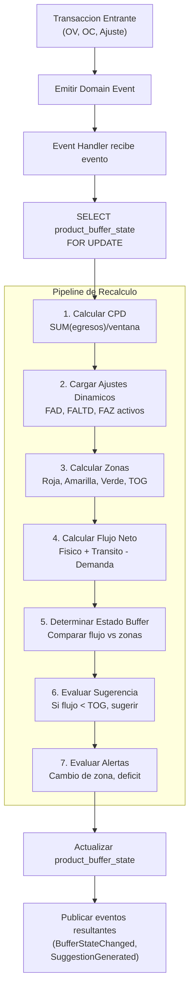
```mermaid
flowchart TD
    TX["Transaccion Entrante<br/>(OV, OC, Ajuste)"]
    EVT["Emitir Domain Event"]
    HANDLER["Event Handler recibe evento"]
    LOCK["SELECT product_buffer_state<br/>FOR UPDATE"]

    subgraph pipeline["Pipeline de Recalculo"]
        CPD["1. Calcular CPD<br/>SUM(egresos)/ventana"]
        ADJ["2. Cargar Ajustes Dinamicos<br/>FAD, FALTD, FAZ activos"]
        ZONES["3. Calcular Zonas<br/>Roja, Amarilla, Verde, TOG"]
        FLOW["4. Calcular Flujo Neto<br/>Fisico + Transito - Demanda"]
        STATUS["5. Determinar Estado Buffer<br/>Comparar flujo vs zonas"]
        SUGGEST["6. Evaluar Sugerencia<br/>Si flujo < TOG, sugerir"]
        ALERT["7. Evaluar Alertas<br/>Cambio de zona, deficit"]
    end

    SAVE["Actualizar product_buffer_state"]
    PUB["Publicar eventos resultantes<br/>(BufferStateChanged,<br/>SuggestionGenerated)"]

    TX --> EVT --> HANDLER --> LOCK
    LOCK --> CPD --> ADJ --> ZONES --> FLOW --> STATUS --> SUGGEST --> ALERT
    ALERT --> SAVE --> PUB
```

**Descripcion:** El pipeline DDMRP se dispara por un Domain Event. El handler adquiere un lock exclusivo sobre el estado del producto, ejecuta los 7 pasos de recalculo secuencialmente, persiste el resultado, y publica eventos derivados. Todo dentro de una transaccion de base de datos.

### 3.8.2 Secuencia: OV Efectuada

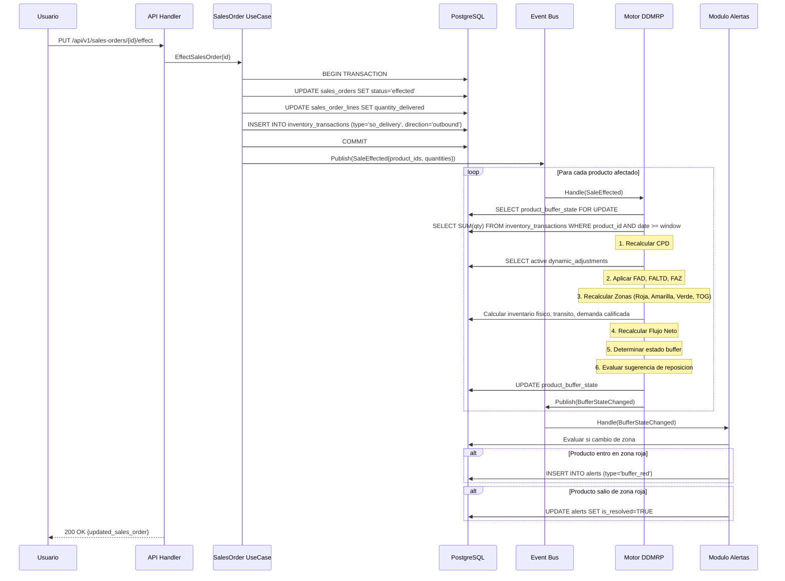
```mermaid
sequenceDiagram
    participant U as Usuario
    participant API as API Handler
    participant SO as SalesOrder UseCase
    participant DB as PostgreSQL
    participant EB as Event Bus
    participant DDMRP as Motor DDMRP
    participant ALERTS as Modulo Alertas

    U->>API: PUT /api/v1/sales-orders/{id}/effect
    API->>SO: EffectSalesOrder(id)
    SO->>DB: BEGIN TRANSACTION
    SO->>DB: UPDATE sales_orders SET status='effected'
    SO->>DB: UPDATE sales_order_lines SET quantity_delivered
    SO->>DB: INSERT INTO inventory_transactions (type='so_delivery', direction='outbound')
    SO->>DB: COMMIT
    SO->>EB: Publish(SaleEffected{product_ids, quantities})

    loop Para cada producto afectado
        EB->>DDMRP: Handle(SaleEffected)
        DDMRP->>DB: SELECT product_buffer_state FOR UPDATE
        DDMRP->>DB: SELECT SUM(qty) FROM inventory_transactions WHERE product_id AND date >= window
        Note over DDMRP: 1. Recalcular CPD
        DDMRP->>DB: SELECT active dynamic_adjustments
        Note over DDMRP: 2. Aplicar FAD, FALTD, FAZ
        Note over DDMRP: 3. Recalcular Zonas (Roja, Amarilla, Verde, TOG)
        DDMRP->>DB: Calcular inventario fisico, transito, demanda calificada
        Note over DDMRP: 4. Recalcular Flujo Neto
        Note over DDMRP: 5. Determinar estado buffer
        Note over DDMRP: 6. Evaluar sugerencia de reposicion
        DDMRP->>DB: UPDATE product_buffer_state
        DDMRP->>EB: Publish(BufferStateChanged)
    end

    EB->>ALERTS: Handle(BufferStateChanged)
    ALERTS->>DB: Evaluar si cambio de zona
    alt Producto entro en zona roja
        ALERTS->>DB: INSERT INTO alerts (type='buffer_red')
    end
    alt Producto salio de zona roja
        ALERTS->>DB: UPDATE alerts SET is_resolved=TRUE
    end

    API-->>U: 200 OK {updated_sales_order}
```

**Descripcion:** Al efectuar una OV, se registra el egreso de inventario, se publica el evento `SaleEffected`, y el Motor DDMRP recalcula CPD (porque es una venta real), zonas, flujo neto y sugerencias para cada producto afectado. Las alertas se evaluan al detectar cambios de zona. Trazabilidad: RF-025, RF-034, RF-045, RF-052, RF-073.

### 3.8.3 Secuencia: OC Recibida (Parcial)

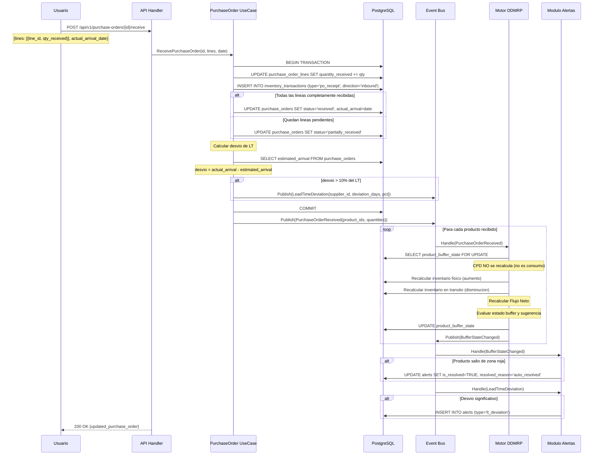
```mermaid
sequenceDiagram
    participant U as Usuario
    participant API as API Handler
    participant PO as PurchaseOrder UseCase
    participant DB as PostgreSQL
    participant EB as Event Bus
    participant DDMRP as Motor DDMRP
    participant ALERTS as Modulo Alertas

    U->>API: POST /api/v1/purchase-orders/{id}/receive
    Note over U: {lines: [{line_id, qty_received}], actual_arrival_date}
    API->>PO: ReceivePurchaseOrder(id, lines, date)
    PO->>DB: BEGIN TRANSACTION
    PO->>DB: UPDATE purchase_order_lines SET quantity_received += qty
    PO->>DB: INSERT INTO inventory_transactions (type='po_receipt', direction='inbound')

    alt Todas las lineas completamente recibidas
        PO->>DB: UPDATE purchase_orders SET status='received', actual_arrival=date
    else Quedan lineas pendientes
        PO->>DB: UPDATE purchase_orders SET status='partially_received'
    end

    Note over PO: Calcular desvio de LT
    PO->>DB: SELECT estimated_arrival FROM purchase_orders
    Note over PO: desvio = actual_arrival - estimated_arrival

    alt desvio > 10% del LT
        PO->>EB: Publish(LeadTimeDeviation{supplier_id, deviation_days, pct})
    end

    PO->>DB: COMMIT
    PO->>EB: Publish(PurchaseOrderReceived{product_ids, quantities})

    loop Para cada producto recibido
        EB->>DDMRP: Handle(PurchaseOrderReceived)
        DDMRP->>DB: SELECT product_buffer_state FOR UPDATE
        Note over DDMRP: CPD NO se recalcula (no es consumo)
        DDMRP->>DB: Recalcular inventario fisico (aumento)
        DDMRP->>DB: Recalcular inventario en transito (disminucion)
        Note over DDMRP: Recalcular Flujo Neto
        Note over DDMRP: Evaluar estado buffer y sugerencia
        DDMRP->>DB: UPDATE product_buffer_state
        DDMRP->>EB: Publish(BufferStateChanged)
    end

    EB->>ALERTS: Handle(BufferStateChanged)
    alt Producto salio de zona roja
        ALERTS->>DB: UPDATE alerts SET is_resolved=TRUE, resolved_reason='auto_resolved'
    end

    EB->>ALERTS: Handle(LeadTimeDeviation)
    alt Desvio significativo
        ALERTS->>DB: INSERT INTO alerts (type='lt_deviation')
    end

    API-->>U: 200 OK {updated_purchase_order}
```

**Descripcion:** Al recibir una OC parcial, se actualiza el inventario (fisico sube, transito baja), se calcula el desvio de LT, y se recalcula el flujo neto. Si el producto sale de zona roja, las alertas se resuelven automaticamente. Trazabilidad: RF-020, RF-047, RF-052, RF-073, RF-075; HU-004 CA-005.

### 3.8.4 Secuencia: Recalculo Completo de un Producto

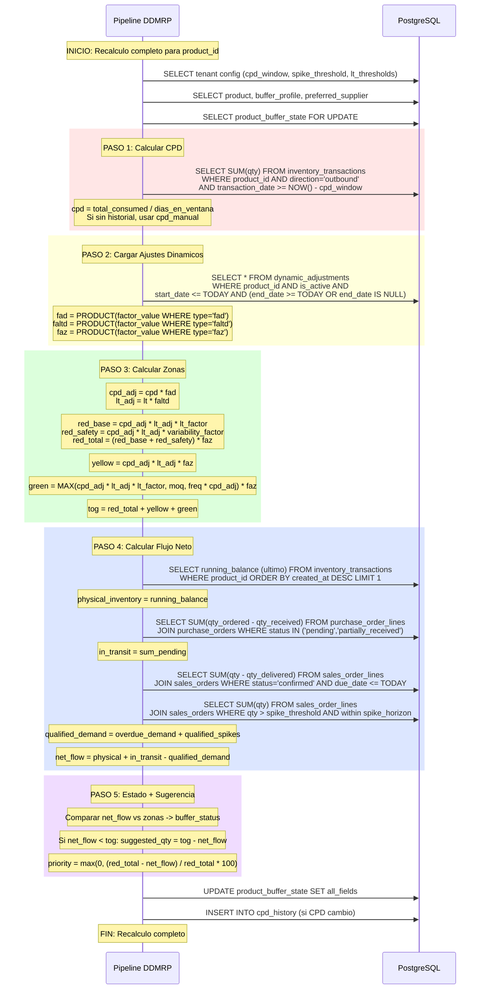
```mermaid
sequenceDiagram
    participant PIPE as Pipeline DDMRP
    participant DB as PostgreSQL

    Note over PIPE: INICIO: Recalculo completo para product_id

    PIPE->>DB: SELECT tenant config (cpd_window, spike_threshold, lt_thresholds)
    PIPE->>DB: SELECT product, buffer_profile, preferred_supplier
    PIPE->>DB: SELECT product_buffer_state FOR UPDATE

    rect rgb(255, 230, 230)
        Note over PIPE: PASO 1: Calcular CPD
        PIPE->>DB: SELECT SUM(qty) FROM inventory_transactions<br/>WHERE product_id AND direction='outbound'<br/>AND transaction_date >= NOW() - cpd_window
        Note over PIPE: cpd = total_consumed / dias_en_ventana<br/>Si sin historial, usar cpd_manual
    end

    rect rgb(255, 255, 220)
        Note over PIPE: PASO 2: Cargar Ajustes Dinamicos
        PIPE->>DB: SELECT * FROM dynamic_adjustments<br/>WHERE product_id AND is_active AND<br/>start_date <= TODAY AND (end_date >= TODAY OR end_date IS NULL)
        Note over PIPE: fad = PRODUCT(factor_value WHERE type='fad')<br/>faltd = PRODUCT(factor_value WHERE type='faltd')<br/>faz = PRODUCT(factor_value WHERE type='faz')
    end

    rect rgb(220, 255, 220)
        Note over PIPE: PASO 3: Calcular Zonas
        Note over PIPE: cpd_adj = cpd * fad<br/>lt_adj = lt * faltd
        Note over PIPE: red_base = cpd_adj * lt_adj * lt_factor<br/>red_safety = cpd_adj * lt_adj * variability_factor<br/>red_total = (red_base + red_safety) * faz
        Note over PIPE: yellow = cpd_adj * lt_adj * faz
        Note over PIPE: green = MAX(cpd_adj * lt_adj * lt_factor, moq, freq * cpd_adj) * faz
        Note over PIPE: tog = red_total + yellow + green
    end

    rect rgb(220, 230, 255)
        Note over PIPE: PASO 4: Calcular Flujo Neto
        PIPE->>DB: SELECT running_balance (ultimo) FROM inventory_transactions<br/>WHERE product_id ORDER BY created_at DESC LIMIT 1
        Note over PIPE: physical_inventory = running_balance
        PIPE->>DB: SELECT SUM(qty_ordered - qty_received) FROM purchase_order_lines<br/>JOIN purchase_orders WHERE status IN ('pending','partially_received')
        Note over PIPE: in_transit = sum_pending
        PIPE->>DB: SELECT SUM(qty - qty_delivered) FROM sales_order_lines<br/>JOIN sales_orders WHERE status='confirmed' AND due_date <= TODAY
        PIPE->>DB: SELECT SUM(qty) FROM sales_order_lines<br/>JOIN sales_orders WHERE qty > spike_threshold AND within spike_horizon
        Note over PIPE: qualified_demand = overdue_demand + qualified_spikes
        Note over PIPE: net_flow = physical + in_transit - qualified_demand
    end

    rect rgb(240, 220, 255)
        Note over PIPE: PASO 5: Estado + Sugerencia
        Note over PIPE: Comparar net_flow vs zonas -> buffer_status
        Note over PIPE: Si net_flow < tog: suggested_qty = tog - net_flow
        Note over PIPE: priority = max(0, (red_total - net_flow) / red_total * 100)
    end

    PIPE->>DB: UPDATE product_buffer_state SET all_fields
    PIPE->>DB: INSERT INTO cpd_history (si CPD cambio)
    Note over PIPE: FIN: Recalculo completo
```

**Descripcion:** El recalculo completo de un producto ejecuta los 5 pasos del pipeline secuencialmente, consultando datos de multiples tablas. Cada paso produce datos que alimentan al siguiente. El resultado se persiste en `product_buffer_state` como cache precalculado.

### 3.8.5 Estados del Buffer

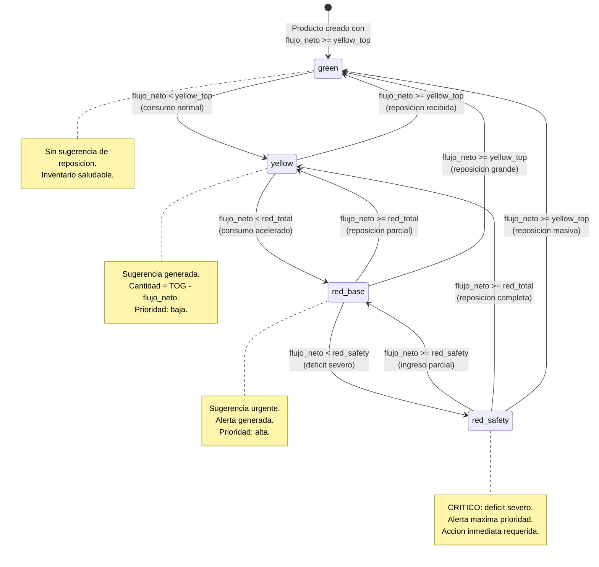
```mermaid
stateDiagram-v2
    [*] --> green : Producto creado con<br/>flujo_neto >= yellow_top

    green --> yellow : flujo_neto < yellow_top<br/>(consumo normal)
    yellow --> green : flujo_neto >= yellow_top<br/>(reposicion recibida)

    yellow --> red_base : flujo_neto < red_total<br/>(consumo acelerado)
    red_base --> yellow : flujo_neto >= red_total<br/>(reposicion parcial)

    red_base --> red_safety : flujo_neto < red_safety<br/>(deficit severo)
    red_safety --> red_base : flujo_neto >= red_safety<br/>(ingreso parcial)

    red_safety --> yellow : flujo_neto >= red_total<br/>(reposicion completa)
    red_safety --> green : flujo_neto >= yellow_top<br/>(reposicion masiva)
    red_base --> green : flujo_neto >= yellow_top<br/>(reposicion grande)

    note right of green
        Sin sugerencia de reposicion.
        Inventario saludable.
    end note

    note right of yellow
        Sugerencia generada.
        Cantidad = TOG - flujo_neto.
        Prioridad: baja.
    end note

    note right of red_base
        Sugerencia urgente.
        Alerta generada.
        Prioridad: alta.
    end note

    note right of red_safety
        CRITICO: deficit severo.
        Alerta maxima prioridad.
        Accion inmediata requerida.
    end note
```

**Descripcion:** Los 4 estados del buffer reflejan la posicion del flujo neto respecto a las zonas calculadas. Las transiciones se disparan por cambios en el flujo neto (ventas, compras, ajustes). Cada transicion puede generar o resolver alertas (RF-073). Los limites son: `yellow_top = red_total + yellow_zone`, `red_total = red_base + red_safety`.

### 3.8.6 Event Bus Interno

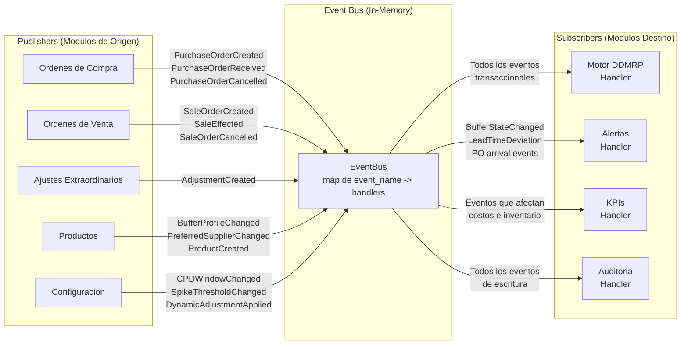
```mermaid
flowchart LR
    subgraph publishers["Publishers (Modulos de Origen)"]
        PO_MOD["Ordenes de Compra"]
        SO_MOD["Ordenes de Venta"]
        ADJ_MOD["Ajustes Extraordinarios"]
        PROD_MOD["Productos"]
        CONFIG["Configuracion"]
    end

    subgraph eventbus["Event Bus (In-Memory)"]
        EB["EventBus<br/>map de event_name -> handlers"]
    end

    subgraph subscribers["Subscribers (Modulos Destino)"]
        DDMRP_H["Motor DDMRP<br/>Handler"]
        ALERT_H["Alertas<br/>Handler"]
        KPI_H["KPIs<br/>Handler"]
        AUDIT_H["Auditoria<br/>Handler"]
    end

    PO_MOD -->|"PurchaseOrderCreated<br/>PurchaseOrderReceived<br/>PurchaseOrderCancelled"| EB
    SO_MOD -->|"SaleOrderCreated<br/>SaleEffected<br/>SaleOrderCancelled"| EB
    ADJ_MOD -->|"AdjustmentCreated"| EB
    PROD_MOD -->|"BufferProfileChanged<br/>PreferredSupplierChanged<br/>ProductCreated"| EB
    CONFIG -->|"CPDWindowChanged<br/>SpikeThresholdChanged<br/>DynamicAdjustmentApplied"| EB

    EB -->|"Todos los eventos<br/>transaccionales"| DDMRP_H
    EB -->|"BufferStateChanged<br/>LeadTimeDeviation<br/>PO arrival events"| ALERT_H
    EB -->|"Eventos que afectan<br/>costos e inventario"| KPI_H
    EB -->|"Todos los eventos<br/>de escritura"| AUDIT_H
```

**Descripcion:** El event bus interno usa un mapa en memoria de `event_name -> []EventHandler`. Los modulos publishers emiten eventos al completar operaciones de negocio. Los subscribers procesan los eventos de forma sincrona dentro del mismo request (para el MVP). El Motor DDMRP es el subscriber principal que reacciona a eventos transaccionales. Las Alertas reaccionan a cambios de estado del buffer. La Auditoria registra todas las operaciones de escritura (RNF-009).

---

# Seccion 4: Diseno de APIs

## 4.1 Convenciones Generales

| Aspecto | Convencion |
|---------|-----------|
| **Base URL** | `https://api.giia.app/api/v1` |
| **Versionado** | Prefijo en URL: `/api/v1/` |
| **Naming** | kebab-case para paths, snake_case para campos JSON |
| **Paginacion** | Query params: `?page=1&page_size=20` (default 20, max 100) |
| **Filtrado** | Query params: `?status=pending&supplier_id=uuid` |
| **Ordenamiento** | Query param: `?sort_by=created_at&sort_dir=desc` |
| **Formato** | JSON (Content-Type: application/json) |
| **Autenticacion** | Bearer token JWT en header `Authorization` |
| **Idioma de respuestas** | Mensajes de error en espanol, campos en ingles |

## 4.2 Autenticacion y Tenant

Cada request autenticado sigue este flujo:
1. El frontend envia `Authorization: Bearer <JWT>`.
2. El middleware decodifica el JWT y extrae `user_id`, `tenant_id`, `role`.
3. El middleware ejecuta `SET LOCAL app.current_tenant_id = '<tenant_id>'` en la conexion de DB.
4. Las queries se ejecutan con RLS habilitado, filtrando por tenant automaticamente.
5. El `role` se usa para verificar permisos en el handler de cada endpoint.

## 4.3 Manejo de Errores Estandarizado

```json
{
  "error": {
    "code": "VALIDATION_ERROR",
    "message": "Los datos proporcionados no son validos",
    "details": [
      {
        "field": "sku",
        "message": "El SKU 'ABC-123' ya existe en el sistema",
        "code": "DUPLICATE_VALUE"
      }
    ]
  }
}
```

Codigos HTTP:
| Codigo | Uso |
|--------|-----|
| 200 | Operacion exitosa |
| 201 | Recurso creado |
| 204 | Eliminacion exitosa |
| 400 | Error de validacion |
| 401 | No autenticado |
| 403 | Sin permisos |
| 404 | Recurso no encontrado |
| 409 | Conflicto (duplicado) |
| 429 | Rate limit excedido |
| 500 | Error interno |

## 4.4 Rate Limiting

**Decision:** Rate limiting por tenant.
- 100 requests/minuto por tenant para endpoints de lectura.
- 30 requests/minuto por tenant para endpoints de escritura.
- 5 requests/minuto para login (por IP) para proteccion contra brute force (RNF-005).

Header de respuesta: `X-RateLimit-Remaining`, `X-RateLimit-Reset`.

## 4.5 Endpoints Completos por Modulo

### Auth & Tenancy (HU-019, RF-095 a RF-101)

| Metodo | Path | Descripcion | Roles |
|--------|------|-------------|-------|
| POST | `/auth/login` | Login con email/password, retorna JWT | Publico |
| POST | `/auth/logout` | Invalida token actual | Todos |
| POST | `/auth/forgot-password` | Envia email de recuperacion | Publico |
| POST | `/auth/reset-password` | Restablece contrasena con token | Publico |
| GET | `/auth/me` | Datos del usuario actual | Todos |
| PUT | `/auth/me/password` | Cambiar contrasena propia | Todos |
| GET | `/users` | Listar usuarios del tenant | Admin |
| POST | `/users` | Crear usuario | Admin |
| GET | `/users/{id}` | Detalle de usuario | Admin |
| PUT | `/users/{id}` | Editar usuario | Admin |
| PUT | `/users/{id}/deactivate` | Desactivar usuario | Admin |
| PUT | `/users/{id}/reset-password` | Resetear contrasena de usuario | Admin |

### Proveedores (HU-001, RF-001 a RF-004)

| Metodo | Path | Descripcion | Roles |
|--------|------|-------------|-------|
| GET | `/suppliers` | Listar proveedores (paginado, filtro status) | Todos |
| POST | `/suppliers` | Crear proveedor | Admin, User |
| GET | `/suppliers/{id}` | Detalle de proveedor | Todos |
| PUT | `/suppliers/{id}` | Editar proveedor | Admin, User |
| PUT | `/suppliers/{id}/deactivate` | Desactivar proveedor | Admin, User |

### Categorias (HU-002, RF-005 a RF-008)

| Metodo | Path | Descripcion | Roles |
|--------|------|-------------|-------|
| GET | `/categories` | Arbol de categorias | Todos |
| POST | `/categories` | Crear categoria | Admin, User |
| GET | `/categories/{id}` | Detalle de categoria | Todos |
| PUT | `/categories/{id}` | Editar categoria | Admin, User |
| DELETE | `/categories/{id}` | Eliminar categoria (sin productos) | Admin, User |

### Productos (HU-003, RF-009 a RF-016)

| Metodo | Path | Descripcion | Roles |
|--------|------|-------------|-------|
| GET | `/products` | Listar productos (filtros: category, supplier, buffer_status) | Todos |
| POST | `/products` | Crear producto + buffer profile | Admin, User |
| GET | `/products/{id}` | Detalle completo (datos, proveedores, buffer, historial) | Todos |
| PUT | `/products/{id}` | Editar producto | Admin, User |
| PUT | `/products/{id}/deactivate` | Desactivar producto | Admin, User |
| GET | `/products/{id}/suppliers` | Proveedores del producto | Todos |
| POST | `/products/{id}/suppliers` | Asignar proveedor | Admin, User |
| PUT | `/products/{id}/suppliers/{supplier_id}` | Editar relacion producto-proveedor | Admin, User |
| DELETE | `/products/{id}/suppliers/{supplier_id}` | Quitar proveedor | Admin, User |
| GET | `/products/{id}/buffer-profile` | Ver perfil de buffer | Todos |
| PUT | `/products/{id}/buffer-profile` | Editar perfil de buffer | Admin, User |
| GET | `/products/{id}/buffer-state` | Estado actual del buffer (zonas, flujo, sugerencia) | Todos |
| GET | `/products/{id}/transactions` | Historial de transacciones del producto | Todos |
| GET | `/products/{id}/cpd-history` | Historial de CPD | Todos |
| GET | `/products/check-sku` | Verificar si SKU existe (`?sku=ABC-123`) | Admin, User |

### Ordenes de Compra (HU-004, RF-017 a RF-023)

| Metodo | Path | Descripcion | Roles |
|--------|------|-------------|-------|
| GET | `/purchase-orders` | Listar OC (filtros: status, supplier, dates) | Todos |
| POST | `/purchase-orders` | Crear OC | Admin, User |
| GET | `/purchase-orders/{id}` | Detalle de OC | Todos |
| PUT | `/purchase-orders/{id}` | Editar OC pendiente | Admin, User |
| POST | `/purchase-orders/{id}/receive` | Registrar recepcion (parcial/total) | Admin, User |
| PUT | `/purchase-orders/{id}/cancel` | Cancelar OC | Admin, User |

### Ordenes de Venta (HU-005, RF-024 a RF-027)

| Metodo | Path | Descripcion | Roles |
|--------|------|-------------|-------|
| GET | `/sales-orders` | Listar OV (filtros: status, dates, products) | Todos |
| POST | `/sales-orders` | Crear OV en firme | Admin, User |
| GET | `/sales-orders/{id}` | Detalle de OV | Todos |
| PUT | `/sales-orders/{id}/effect` | Efectuar OV (genera egreso) | Admin, User |
| PUT | `/sales-orders/{id}/cancel` | Cancelar OV | Admin, User |

### Ajustes Extraordinarios (HU-006, RF-028 a RF-030)

| Metodo | Path | Descripcion | Roles |
|--------|------|-------------|-------|
| GET | `/adjustments` | Listar ajustes (filtros: direction, type, product, dates) | Todos |
| POST | `/adjustments` | Registrar ajuste (ingreso o egreso) | Admin, User |
| POST | `/adjustments/batch` | Registrar multiples ajustes (conteo fisico) | Admin, User |
| GET | `/adjustments/{id}` | Detalle de ajuste | Todos |

### Motor DDMRP (HU-007 a HU-012, RF-031 a RF-062)

| Metodo | Path | Descripcion | Roles |
|--------|------|-------------|-------|
| GET | `/ddmrp/buffer-states` | Todos los estados de buffer (paginado) | Todos |
| GET | `/ddmrp/buffer-states/{product_id}` | Estado de buffer de un producto | Todos |
| POST | `/ddmrp/recalculate/{product_id}` | Forzar recalculo completo | Admin |
| POST | `/ddmrp/recalculate-all` | Recalcular todos los productos | Admin |
| GET | `/ddmrp/suggestions` | Listar sugerencias activas | Todos |
| GET | `/ddmrp/suggestions?group_by=supplier` | Sugerencias agrupadas por proveedor | Todos |
| PUT | `/ddmrp/suggestions/{id}/dismiss` | Descartar sugerencia | Admin, User |
| GET | `/dynamic-adjustments` | Listar ajustes dinamicos | Todos |
| POST | `/dynamic-adjustments` | Crear ajuste dinamico (FAD/FAZ/FALTD) | Admin, User |
| PUT | `/dynamic-adjustments/{id}` | Editar ajuste dinamico | Admin, User |
| DELETE | `/dynamic-adjustments/{id}` | Eliminar ajuste dinamico | Admin, User |

### Dashboard (HU-013, RF-063 a RF-068)

| Metodo | Path | Descripcion | Roles |
|--------|------|-------------|-------|
| GET | `/dashboard/state` | Estado completo del dashboard (semaforo + criticos + KPIs) | Todos |
| GET | `/dashboard/critical-products` | Productos en zona roja ordenados por prioridad | Todos |
| GET | `/dashboard/trends/{product_id}` | Tendencia de flujo neto ultimos N dias | Todos |

### Planificacion (HU-014, RF-069 a RF-072)

| Metodo | Path | Descripcion | Roles |
|--------|------|-------------|-------|
| GET | `/planning/replenishments` | Lista de reposiciones pendientes | Todos |
| POST | `/planning/create-po` | Crear OC desde sugerencias seleccionadas | Admin, User |
| GET | `/planning/calendar` | Calendario de llegadas de OC | Todos |

### Alertas (HU-015, RF-073 a RF-078)

| Metodo | Path | Descripcion | Roles |
|--------|------|-------------|-------|
| GET | `/alerts` | Listar alertas (filtros: type, is_read, severity) | Todos |
| GET | `/alerts/unread-count` | Contador de alertas no leidas (para polling) | Todos |
| PUT | `/alerts/{id}/read` | Marcar como leida | Todos |
| PUT | `/alerts/read-all` | Marcar todas como leidas | Todos |

### KPIs (HU-016, RF-079 a RF-085)

| Metodo | Path | Descripcion | Roles |
|--------|------|-------------|-------|
| GET | `/kpis/current` | 4 KPIs actuales + comparativa vs periodo anterior | Todos |
| GET | `/kpis/history` | Historico de KPIs (`?from=&to=`) | Todos |
| GET | `/kpis/export` | Exportar KPIs a CSV/PDF | Todos |

### Importacion CSV (HU-018, RF-090 a RF-094)

| Metodo | Path | Descripcion | Roles |
|--------|------|-------------|-------|
| POST | `/imports/upload` | Subir archivo CSV | Admin |
| POST | `/imports/{id}/validate` | Validar y generar preview | Admin |
| POST | `/imports/{id}/confirm` | Confirmar importacion (de registros validos) | Admin |
| GET | `/imports/{id}/status` | Estado de importacion (para polling) | Admin |
| GET | `/imports` | Historial de importaciones | Admin |
| GET | `/imports/templates/{type}` | Descargar template CSV | Admin, User |

### Configuracion y Multi-moneda (HU-020, RF-102 a RF-105)

| Metodo | Path | Descripcion | Roles |
|--------|------|-------------|-------|
| GET | `/config/tenant` | Configuracion del tenant actual | Admin |
| PUT | `/config/tenant` | Editar configuracion del tenant | Admin |
| GET | `/config/currencies` | Configuracion de monedas | Todos |
| PUT | `/config/currencies` | Actualizar tipo de cambio | Admin |
| GET | `/config/lt-thresholds` | Umbrales de Lead Time | Todos |
| PUT | `/config/lt-thresholds` | Actualizar umbrales de LT | Admin |

## 4.6 Diagramas de Secuencia

### 4.6.1 Flujo de Autenticacion

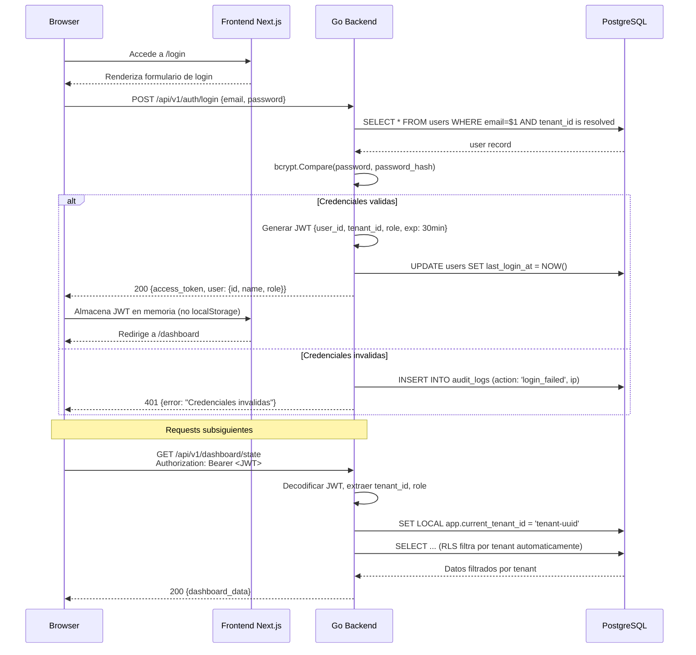
```mermaid
sequenceDiagram
    participant B as Browser
    participant FE as Frontend Next.js
    participant API as Go Backend
    participant DB as PostgreSQL

    B->>FE: Accede a /login
    FE-->>B: Renderiza formulario de login

    B->>API: POST /api/v1/auth/login {email, password}
    API->>DB: SELECT * FROM users WHERE email=$1 AND tenant_id is resolved
    DB-->>API: user record
    API->>API: bcrypt.Compare(password, password_hash)

    alt Credenciales validas
        API->>API: Generar JWT {user_id, tenant_id, role, exp: 30min}
        API->>DB: UPDATE users SET last_login_at = NOW()
        API-->>B: 200 {access_token, user: {id, name, role}}
        B->>FE: Almacena JWT en memoria (no localStorage)
        FE-->>B: Redirige a /dashboard
    else Credenciales invalidas
        API->>DB: INSERT INTO audit_logs (action: 'login_failed', ip)
        API-->>B: 401 {error: "Credenciales invalidas"}
    end

    Note over B,API: Requests subsiguientes

    B->>API: GET /api/v1/dashboard/state<br/>Authorization: Bearer <JWT>
    API->>API: Decodificar JWT, extraer tenant_id, role
    API->>DB: SET LOCAL app.current_tenant_id = 'tenant-uuid'
    API->>DB: SELECT ... (RLS filtra por tenant automaticamente)
    DB-->>API: Datos filtrados por tenant
    API-->>B: 200 {dashboard_data}
```

**Descripcion:** El flujo de autenticacion inicia con login email/password. El backend valida credenciales con bcrypt (RNF-005), genera un JWT con `tenant_id` y `role`. En requests subsiguientes, el middleware extrae el `tenant_id` del JWT, lo inyecta como variable de sesion PostgreSQL, y RLS filtra automaticamente. Trazabilidad: RF-095, RF-101, RNF-005, RNF-007, RNF-008.

### 4.6.2 Flujo de Polling del Dashboard

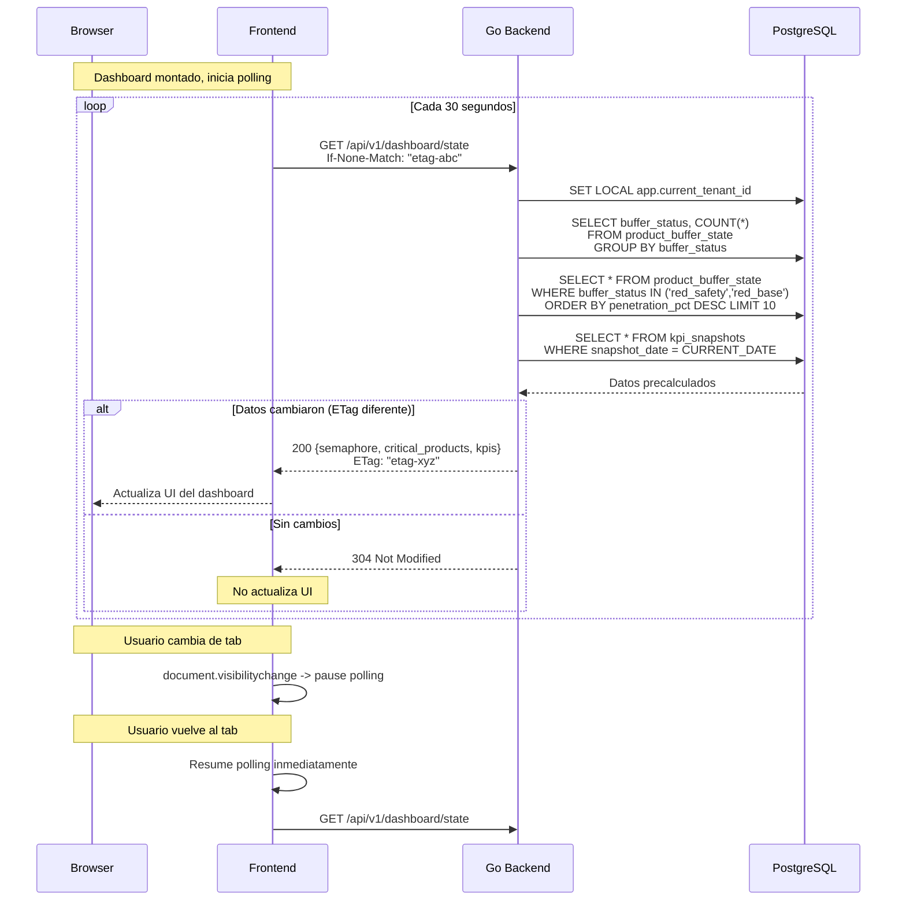
```mermaid
sequenceDiagram
    participant B as Browser
    participant FE as Frontend
    participant API as Go Backend
    participant DB as PostgreSQL

    Note over B,FE: Dashboard montado, inicia polling

    loop Cada 30 segundos
        FE->>API: GET /api/v1/dashboard/state<br/>If-None-Match: "etag-abc"
        API->>DB: SET LOCAL app.current_tenant_id
        API->>DB: SELECT buffer_status, COUNT(*)<br/>FROM product_buffer_state<br/>GROUP BY buffer_status
        API->>DB: SELECT * FROM product_buffer_state<br/>WHERE buffer_status IN ('red_safety','red_base')<br/>ORDER BY penetration_pct DESC LIMIT 10
        API->>DB: SELECT * FROM kpi_snapshots<br/>WHERE snapshot_date = CURRENT_DATE
        DB-->>API: Datos precalculados

        alt Datos cambiaron (ETag diferente)
            API-->>FE: 200 {semaphore, critical_products, kpis}<br/>ETag: "etag-xyz"
            FE-->>B: Actualiza UI del dashboard
        else Sin cambios
            API-->>FE: 304 Not Modified
            Note over FE: No actualiza UI
        end
    end

    Note over B,FE: Usuario cambia de tab
    FE->>FE: document.visibilitychange -> pause polling

    Note over B,FE: Usuario vuelve al tab
    FE->>FE: Resume polling inmediatamente
    FE->>API: GET /api/v1/dashboard/state
```

**Descripcion:** El dashboard usa polling cada 30 segundos con soporte ETag para evitar transferencias innecesarias. Los datos provienen de tablas precalculadas (`product_buffer_state`, `kpi_snapshots`) para cumplir el objetivo de < 3 segundos (RNF-001). El polling se pausa cuando el tab no es visible. Trazabilidad: RF-063 a RF-068; HU-013.

### 4.6.3 Flujo de Creacion de OC desde Sugerencia

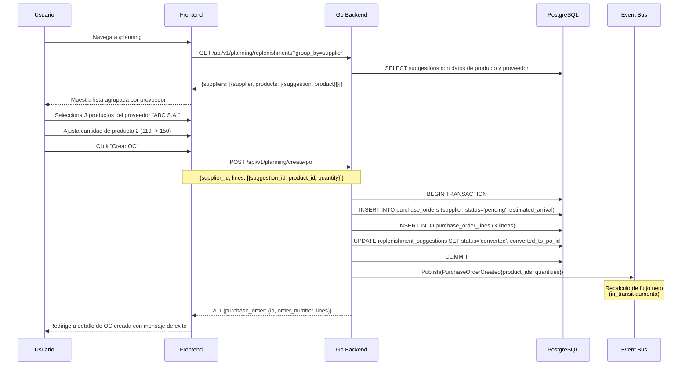
```mermaid
sequenceDiagram
    participant U as Usuario
    participant FE as Frontend
    participant API as Go Backend
    participant DB as PostgreSQL
    participant EB as Event Bus

    U->>FE: Navega a /planning
    FE->>API: GET /api/v1/planning/replenishments?group_by=supplier
    API->>DB: SELECT suggestions con datos de producto y proveedor
    API-->>FE: {suppliers: [{supplier, products: [{suggestion, product}]}]}
    FE-->>U: Muestra lista agrupada por proveedor

    U->>FE: Selecciona 3 productos del proveedor "ABC S.A."
    U->>FE: Ajusta cantidad de producto 2 (110 -> 150)
    U->>FE: Click "Crear OC"

    FE->>API: POST /api/v1/planning/create-po
    Note over FE,API: {supplier_id, lines: [{suggestion_id, product_id, quantity}]}
    API->>DB: BEGIN TRANSACTION
    API->>DB: INSERT INTO purchase_orders (supplier, status='pending', estimated_arrival)
    API->>DB: INSERT INTO purchase_order_lines (3 lineas)
    API->>DB: UPDATE replenishment_suggestions SET status='converted', converted_to_po_id
    API->>DB: COMMIT
    API->>EB: Publish(PurchaseOrderCreated{product_ids, quantities})

    Note over EB: Recalculo de flujo neto<br/>(in_transit aumenta)

    API-->>FE: 201 {purchase_order: {id, order_number, lines}}
    FE-->>U: Redirige a detalle de OC creada con mensaje de exito
```

**Descripcion:** Desde la pantalla de planificacion, el usuario selecciona sugerencias agrupadas por proveedor, ajusta cantidades si necesario, y genera una OC consolidada con un click. Las sugerencias se marcan como convertidas y el flujo neto se recalcula reflejando el nuevo inventario en transito. Trazabilidad: RF-056, RF-069 a RF-072; HU-014 CA-005.

### 4.6.4 Flujo de Importacion CSV

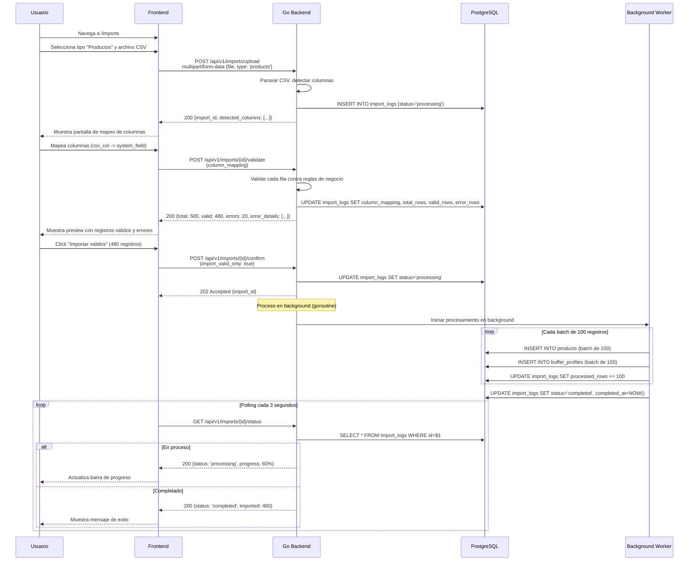
```mermaid
sequenceDiagram
    participant U as Usuario
    participant FE as Frontend
    participant API as Go Backend
    participant DB as PostgreSQL
    participant BG as Background Worker

    U->>FE: Navega a /imports
    U->>FE: Selecciona tipo "Productos" y archivo CSV

    FE->>API: POST /api/v1/imports/upload<br/>multipart/form-data {file, type: 'products'}
    API->>API: Parsear CSV, detectar columnas
    API->>DB: INSERT INTO import_logs (status='processing')
    API-->>FE: 200 {import_id, detected_columns: [...]}
    FE-->>U: Muestra pantalla de mapeo de columnas

    U->>FE: Mapea columnas (csv_col -> system_field)
    FE->>API: POST /api/v1/imports/{id}/validate<br/>{column_mapping}
    API->>API: Validar cada fila contra reglas de negocio
    API->>DB: UPDATE import_logs SET column_mapping, total_rows, valid_rows, error_rows
    API-->>FE: 200 {total: 500, valid: 480, errors: 20, error_details: [...]}
    FE-->>U: Muestra preview con registros validos y errores

    U->>FE: Click "Importar validos" (480 registros)
    FE->>API: POST /api/v1/imports/{id}/confirm<br/>{import_valid_only: true}
    API->>DB: UPDATE import_logs SET status='processing'
    API-->>FE: 202 Accepted {import_id}
    Note over API: Proceso en background (goroutine)

    API->>BG: Iniciar procesamiento en background
    loop Cada batch de 100 registros
        BG->>DB: INSERT INTO products (batch de 100)
        BG->>DB: INSERT INTO buffer_profiles (batch de 100)
        BG->>DB: UPDATE import_logs SET processed_rows += 100
    end
    BG->>DB: UPDATE import_logs SET status='completed', completed_at=NOW()

    loop Polling cada 3 segundos
        FE->>API: GET /api/v1/imports/{id}/status
        API->>DB: SELECT * FROM import_logs WHERE id=$1
        alt En proceso
            API-->>FE: 200 {status: 'processing', progress: 60%}
            FE-->>U: Actualiza barra de progreso
        else Completado
            API-->>FE: 200 {status: 'completed', imported: 480}
            FE-->>U: Muestra mensaje de exito
        end
    end
```

**Descripcion:** La importacion CSV sigue un flujo de 4 pasos: (1) Upload y deteccion de columnas, (2) Mapeo de columnas por el usuario, (3) Validacion con preview de errores, (4) Confirmacion y procesamiento en background con polling de progreso. Trazabilidad: RF-090 a RF-094; HU-018; RNF-004 (5000 registros < 60s).

---

# Seccion 5: Diseno del Frontend

## 5.1 Arquitectura Next.js

**Decision:** Next.js App Router con estructura por feature.
**Justificacion:** App Router permite layouts anidados con guards de permisos, server components para carga inicial rapida, y route groups para organizar por modulo.

### Estructura de carpetas

```
src/
  app/
    (auth)/
      login/page.tsx
      forgot-password/page.tsx
      reset-password/page.tsx
      layout.tsx               -- Layout sin sidebar para auth
    (app)/
      layout.tsx               -- Layout principal con sidebar + header + guard de auth
      dashboard/page.tsx       -- HU-013
      suppliers/
        page.tsx               -- Lista de proveedores (HU-001)
        new/page.tsx
        [id]/page.tsx          -- Detalle/edicion
      categories/
        page.tsx               -- Arbol de categorias (HU-002)
      products/
        page.tsx               -- Lista de productos (HU-003)
        new/page.tsx
        [id]/page.tsx          -- Detalle completo
        [id]/buffer/page.tsx   -- Perfil de buffer (HU-008, HU-009)
      purchase-orders/
        page.tsx               -- Lista de OC (HU-004)
        new/page.tsx
        [id]/page.tsx          -- Detalle con recepcion
      sales-orders/
        page.tsx               -- Lista de OV (HU-005)
        new/page.tsx
        [id]/page.tsx
      adjustments/
        page.tsx               -- Ajustes extraordinarios (HU-006)
        new/page.tsx
      planning/
        page.tsx               -- Planificacion de reposiciones (HU-014)
        calendar/page.tsx      -- Vista calendario (Should)
      alerts/
        page.tsx               -- Centro de notificaciones (HU-015)
      kpis/
        page.tsx               -- Dashboard de KPIs (HU-016)
      imports/
        page.tsx               -- Importacion CSV (HU-018)
        [id]/page.tsx          -- Detalle de importacion
      dynamic-adjustments/
        page.tsx               -- Ajustes dinamicos (HU-012)
        new/page.tsx
      settings/
        page.tsx               -- Configuracion general (HU-020)
        users/page.tsx         -- Gestion de usuarios (HU-019)
        currencies/page.tsx    -- Configuracion multi-moneda
  components/
    ui/                        -- Componentes base (Button, Input, Select, Table, Modal)
    layout/
      Sidebar.tsx
      Header.tsx
      NotificationBell.tsx     -- Badge con contador de alertas
    dashboard/
      SemaphoreChart.tsx       -- Grafico de semaforo (donut/barra)
      CriticalProductsList.tsx
      KPISummaryCards.tsx
      BufferBarChart.tsx       -- Barra de buffer por producto
    forms/
      SupplierForm.tsx
      ProductForm.tsx
      PurchaseOrderForm.tsx
      SalesOrderForm.tsx
      AdjustmentForm.tsx
      FuzzyAutocomplete.tsx    -- Autocompletado fuzzy (RF-089)
    tables/
      DataTable.tsx            -- Tabla generica con paginacion, filtros, ordenamiento
      ProductTable.tsx
      OrderTable.tsx
    buffer/
      BufferVisualization.tsx  -- Barra horizontal con zonas R/A/V (HU-009 CA-005)
      BufferTrend.tsx          -- Grafico de tendencia (HU-013 CA-006)
    imports/
      CSVUploader.tsx
      ColumnMapper.tsx
      ImportPreview.tsx
  hooks/
    usePolling.ts              -- Hook de polling con backoff y visibilidad
    useAuth.ts                 -- Contexto de autenticacion
    useTenant.ts               -- Configuracion del tenant
  lib/
    api.ts                     -- Wrapper de fetch con JWT
    auth.ts                    -- Utilidades de autenticacion
    polling.ts                 -- Configuracion de intervalos
  types/
    index.ts                   -- Tipos TypeScript compartidos
```

## 5.2 State Management

**Decision:** React Server Components + SWR para data fetching con cache.
**Alternativas consideradas:** Redux, Zustand, React Query.
**Justificacion:** SWR provee caching, revalidacion automatica, y deduplicacion de requests -- ideal para el patron de polling. No se necesita estado global complejo dado que la mayoria de datos viene del servidor.

- **SWR** para: data fetching, polling, cache de respuestas API.
- **React Context** para: estado de autenticacion (JWT, user, role), configuracion del tenant.
- **useState/useReducer** para: estado local de formularios, modals, tabs.

## 5.3 Estrategia de Polling

```typescript
// hooks/usePolling.ts
function usePolling<T>(endpoint: string, interval: number) {
  const { data, error, mutate } = useSWR<T>(endpoint, fetcher, {
    refreshInterval: interval,
    revalidateOnFocus: true,
    dedupingInterval: interval / 2,
    isPaused: () => document.visibilityState === 'hidden',
  });
  return { data, error, refresh: mutate };
}

// Uso en Dashboard
const { data: dashboardState } = usePolling('/dashboard/state', 30_000);
const { data: alertCount } = usePolling('/alerts/unread-count', 60_000);
const { data: kpis } = usePolling('/kpis/current', 300_000);
```

## 5.4 Mapa de Pantallas

| Ruta | Pantalla | Permisos | Datos API | HU |
|------|----------|----------|-----------|-----|
| `/login` | Login | Publico | POST /auth/login | HU-019 |
| `/forgot-password` | Recuperar contrasena | Publico | POST /auth/forgot-password | HU-019 |
| `/dashboard` | Dashboard principal | Todos | GET /dashboard/state, /alerts/unread-count, /kpis/current | HU-013, HU-016 |
| `/suppliers` | Lista de proveedores | Todos (RO: solo lectura) | GET /suppliers | HU-001 |
| `/suppliers/new` | Crear proveedor | Admin, User | POST /suppliers | HU-001 |
| `/suppliers/[id]` | Detalle/editar proveedor | Todos / Admin,User | GET/PUT /suppliers/{id} | HU-001 |
| `/categories` | Arbol de categorias | Todos | GET /categories | HU-002 |
| `/products` | Lista de productos | Todos | GET /products | HU-003 |
| `/products/new` | Crear producto | Admin, User | POST /products | HU-003, HU-008 |
| `/products/[id]` | Detalle de producto | Todos | GET /products/{id} + buffer-state + transactions | HU-003, HU-009, HU-010 |
| `/purchase-orders` | Lista de OC | Todos | GET /purchase-orders | HU-004 |
| `/purchase-orders/new` | Crear OC | Admin, User | POST /purchase-orders | HU-004 |
| `/purchase-orders/[id]` | Detalle OC + recepcion | Todos / Admin,User | GET/POST /purchase-orders/{id} | HU-004 |
| `/sales-orders` | Lista de OV | Todos | GET /sales-orders | HU-005 |
| `/sales-orders/new` | Crear OV | Admin, User | POST /sales-orders | HU-005 |
| `/sales-orders/[id]` | Detalle OV | Todos | GET /sales-orders/{id} | HU-005 |
| `/adjustments` | Historial de ajustes | Todos | GET /adjustments | HU-006 |
| `/adjustments/new` | Registrar ajuste | Admin, User | POST /adjustments | HU-006 |
| `/planning` | Planificacion de reposiciones | Todos | GET /planning/replenishments | HU-014 |
| `/planning/calendar` | Calendario de llegadas | Todos | GET /planning/calendar | HU-014 |
| `/alerts` | Centro de notificaciones | Todos | GET /alerts | HU-015 |
| `/kpis` | Dashboard de KPIs | Todos | GET /kpis/current, /kpis/history | HU-016 |
| `/imports` | Importacion CSV | Admin | GET /imports, POST /imports/upload | HU-018 |
| `/dynamic-adjustments` | Ajustes dinamicos | Admin, User | GET/POST /dynamic-adjustments | HU-012 |
| `/settings` | Configuracion general | Admin | GET/PUT /config/tenant | HU-020 |
| `/settings/users` | Gestion de usuarios | Admin | GET/POST /users | HU-019 |
| `/settings/currencies` | Multi-moneda | Admin | GET/PUT /config/currencies | HU-020 |

## 5.5 Sistema de Semaforo Visual

**Colores y accesibilidad (RF-044, RNF-011):**

| Zona | Color primario | Color accesible (daltonismo) | Patron adicional |
|------|---------------|------------------------------|------------------|
| Rojo (seguridad) | `#991B1B` (rojo oscuro) | + Patron de rayas diagonales | Icono: triangulo de alerta |
| Rojo (base) | `#DC2626` (rojo) | + Patron punteado | Icono: circulo lleno |
| Amarillo | `#F59E0B` (ambar) | Sin patron | Icono: circulo medio |
| Verde | `#16A34A` (verde) | Sin patron | Icono: circulo vacio |

Adicionalmente:
- Cada zona tiene un label textual visible ("Critico", "Precaucion", "Saludable").
- Los graficos de buffer usan textura ademas de color.
- Contraste WCAG AA minimo en todos los textos sobre fondo de color.

## 5.6 Componentes Reutilizables

| Componente | Descripcion | Usado en |
|------------|-------------|----------|
| `DataTable` | Tabla con paginacion, filtros, ordenamiento, seleccion multiple | Todas las listas |
| `BufferVisualization` | Barra horizontal con zonas R/A/V y linea de flujo neto | Dashboard, detalle de producto |
| `FuzzyAutocomplete` | Input con busqueda fuzzy en proveedores/productos | Formularios de OC, OV, ajustes |
| `SemaphoreChart` | Donut chart con % por zona | Dashboard |
| `KPICard` | Tarjeta con valor actual, cambio vs anterior, flecha arriba/abajo | Dashboard, KPIs |
| `FormWrapper` | Wrapper de formulario con validacion, dirty check, unsaved changes warning | Todos los formularios |
| `CSVUploader` | Drag-and-drop de archivo con deteccion de tipo | Importacion |
| `ColumnMapper` | UI para mapear columnas CSV a campos del sistema | Importacion |
| `NotificationBell` | Icono campana con badge de conteo | Header global |
| `TreeView` | Visualizacion de arbol expandible/contraible | Categorias |
| `DateRangePicker` | Selector de rango de fechas | Filtros de listas |
| `CurrencyInput` | Input numerico con selector de moneda | Formularios con montos |

## 5.7 Estrategia de Formularios

- **Validacion client-side** con `zod` para schemas + `react-hook-form` para estado del formulario.
- **Validacion en tiempo real** (RF-088): los campos se validan on-blur y on-change con debounce de 300ms.
- **SKU unico** (HU-003 CA-002): on-blur del campo SKU, se llama a `GET /products/check-sku?sku=valor` con debounce.
- **Autocompletado fuzzy** (RF-089): usa `fuse.js` client-side con datos precargados para listas pequenas (< 1000 items), o llamada a API con `?q=term` para listas grandes.
- **Unsaved changes warning** (HU-017 escenario): `beforeunload` event + React Router prompt.
- **Feedback < 200ms** (RNF-013): loading states inmediatos, skeleton screens, optimistic updates con SWR.

## 5.8 Diagramas del Frontend

### 5.8.1 Mapa de Navegacion

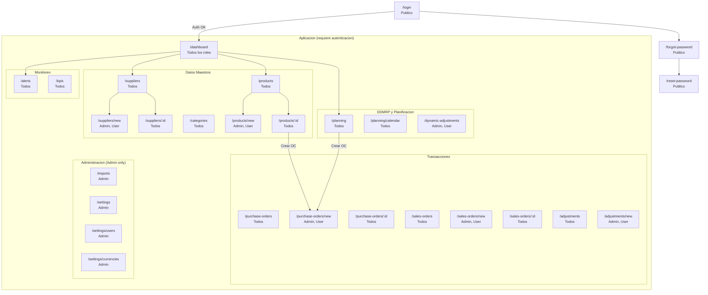
```mermaid
flowchart TD
    LOGIN["/login<br/>Publico"]
    FORGOT["/forgot-password<br/>Publico"]
    RESET["/reset-password<br/>Publico"]

    LOGIN --> FORGOT
    FORGOT --> RESET
    LOGIN -->|"Auth OK"| DASH

    subgraph app["Aplicacion (requiere autenticacion)"]
        DASH["/dashboard<br/>Todos los roles"]

        subgraph masters["Datos Maestros"]
            SUP["/suppliers<br/>Todos"]
            SUP_NEW["/suppliers/new<br/>Admin, User"]
            SUP_DET["/suppliers/:id<br/>Todos"]
            CAT["/categories<br/>Todos"]
            PROD["/products<br/>Todos"]
            PROD_NEW["/products/new<br/>Admin, User"]
            PROD_DET["/products/:id<br/>Todos"]
        end

        subgraph transactions["Transacciones"]
            PO["/purchase-orders<br/>Todos"]
            PO_NEW["/purchase-orders/new<br/>Admin, User"]
            PO_DET["/purchase-orders/:id<br/>Todos"]
            SO["/sales-orders<br/>Todos"]
            SO_NEW["/sales-orders/new<br/>Admin, User"]
            SO_DET["/sales-orders/:id<br/>Todos"]
            ADJ["/adjustments<br/>Todos"]
            ADJ_NEW["/adjustments/new<br/>Admin, User"]
        end

        subgraph ddmrp_views["DDMRP y Planificacion"]
            PLAN["/planning<br/>Todos"]
            PLAN_CAL["/planning/calendar<br/>Todos"]
            DYN["/dynamic-adjustments<br/>Admin, User"]
        end

        subgraph monitoring["Monitoreo"]
            ALERTS["/alerts<br/>Todos"]
            KPIS["/kpis<br/>Todos"]
        end

        subgraph admin_views["Administracion (Admin only)"]
            IMP["/imports<br/>Admin"]
            SETTINGS["/settings<br/>Admin"]
            USERS["/settings/users<br/>Admin"]
            CURR["/settings/currencies<br/>Admin"]
        end

        DASH --> SUP
        DASH --> PROD
        DASH --> PLAN
        DASH --> ALERTS
        SUP --> SUP_NEW
        SUP --> SUP_DET
        PROD --> PROD_NEW
        PROD --> PROD_DET
        PROD_DET -->|"Crear OC"| PO_NEW
        PLAN -->|"Crear OC"| PO_NEW
    end
```

**Descripcion:** Mapa de navegacion completo con guards de permisos por rol. Las rutas bajo `/settings` y `/imports` requieren rol Admin. Las rutas de creacion/edicion requieren Admin o User. Las rutas de consulta estan disponibles para todos los roles incluyendo Solo Lectura. Trazabilidad: RF-097, RF-098, RF-099.

### 5.8.2 Componentes del Dashboard

```mermaid
flowchart TD
    subgraph dashboard["Dashboard Page"]
        subgraph header_section["Seccion Superior"]
            SEM["SemaphoreChart<br/>(Donut: % Rojo/Amarillo/Verde)"]
            KPI1["KPICard: Costo Total"]
            KPI2["KPICard: Dias Inventario"]
            KPI3["KPICard: Inmovilizado"]
            KPI4["KPICard: Rotacion"]
        end

        subgraph filters["Barra de Filtros"]
            F_CAT["Filtro Categoria<br/>(TreeSelect)"]
            F_SUP["Filtro Proveedor<br/>(Select)"]
            F_STATUS["Filtro Estado Buffer<br/>(MultiSelect)"]
        end

        subgraph critical["Productos Criticos"]
            CRIT_LIST["CriticalProductsList<br/>(Tabla ordenada por penetracion)"]
            BUFF_BAR["BufferVisualization<br/>(por cada producto critico)"]
        end

        subgraph trend["Tendencia (on click de producto)"]
            TREND["BufferTrend<br/>(Grafico lineal: flujo neto vs zonas<br/>ultimos 30 dias)"]
        end
    end

    SEM --- KPI1
    KPI1 --- KPI2
    KPI2 --- KPI3
    KPI3 --- KPI4
    F_CAT --> CRIT_LIST
    F_SUP --> CRIT_LIST
    CRIT_LIST --> BUFF_BAR
    CRIT_LIST -->|"Click producto"| TREND
```

**Descripcion:** El dashboard se compone de: (1) Semaforo general con distribucion por zona, (2) 4 tarjetas KPI con comparativa, (3) Filtros por categoria/proveedor/estado, (4) Lista de productos criticos con visualizacion de buffer individual, (5) Grafico de tendencia al hacer click en un producto. Trazabilidad: RF-063 a RF-068, RF-079 a RF-084; HU-013, HU-016.

### 5.8.3 Flujo de Creacion de Producto

```mermaid
flowchart TD
    START["Usuario navega a<br/>/products/new"]
    FORM["Formulario de producto<br/>(SKU, Nombre, Categoria,<br/>Costo, Unidad, etc.)"]
    SKU_CHECK{"SKU unico?<br/>(validacion async)"}
    VALID{"Campos obligatorios<br/>completos?"}
    SUPPLIERS["Paso 2: Asignar Proveedores<br/>(seleccionar, LT, MOQ, Freq)<br/>Marcar preferido"]
    BUFFER["Paso 3: Perfil de Buffer<br/>(Cat. LT, Factor LT,<br/>Factor Variabilidad)"]
    CPD_MANUAL{"Producto tiene<br/>historial de ventas?"}
    CPD_INPUT["Ingresar CPD estimado<br/>(manual)"]
    REVIEW["Paso 4: Revision final<br/>(resumen de todos los datos)"]
    SAVE["POST /api/v1/products"]
    SUCCESS["Producto creado.<br/>Buffer profile creado.<br/>Zonas calculadas<br/>automaticamente."]
    REDIRECT["Redirigir a<br/>/products/:id"]

    START --> FORM
    FORM --> SKU_CHECK
    SKU_CHECK -->|"No"| FORM
    SKU_CHECK -->|"Si"| VALID
    VALID -->|"No"| FORM
    VALID -->|"Si"| SUPPLIERS
    SUPPLIERS --> BUFFER
    BUFFER --> CPD_MANUAL
    CPD_MANUAL -->|"No"| CPD_INPUT
    CPD_MANUAL -->|"Si"| REVIEW
    CPD_INPUT --> REVIEW
    REVIEW --> SAVE
    SAVE --> SUCCESS
    SUCCESS --> REDIRECT
```

**Descripcion:** La creacion de un producto sigue un flujo de 4 pasos: (1) Datos basicos con validacion de SKU unico en tiempo real, (2) Asignacion de proveedores con sus atributos, (3) Configuracion del perfil de buffer (creado automaticamente segun HU-008), (4) Revision y confirmacion. Si el producto no tiene historial, se solicita CPD manual (HU-007). Al guardar, el sistema calcula las zonas automaticamente. Trazabilidad: RF-009 a RF-016; HU-003, HU-008.

---

# Seccion 6: Seguridad y Multi-tenancy

## 6.1 Row-Level Security (RLS) en Detalle

### Implementacion Tecnica

```sql
-- 1. Crear un rol de aplicacion (no superuser)
CREATE ROLE giia_app LOGIN PASSWORD 'secure_password';

-- 2. Funcion helper para obtener el tenant_id actual
CREATE OR REPLACE FUNCTION current_tenant_id() RETURNS UUID AS $$
    SELECT current_setting('app.current_tenant_id', true)::uuid;
$$ LANGUAGE SQL STABLE;

-- 3. Politica generica para cada tabla (ejemplo: products)
CREATE POLICY tenant_isolation_select ON products
    FOR SELECT USING (tenant_id = current_tenant_id());

CREATE POLICY tenant_isolation_insert ON products
    FOR INSERT WITH CHECK (tenant_id = current_tenant_id());

CREATE POLICY tenant_isolation_update ON products
    FOR UPDATE USING (tenant_id = current_tenant_id())
    WITH CHECK (tenant_id = current_tenant_id());

CREATE POLICY tenant_isolation_delete ON products
    FOR DELETE USING (tenant_id = current_tenant_id());
```

### Flujo en el Backend Go

```go
// middleware/tenant.go
func TenantMiddleware(next http.Handler) http.Handler {
    return http.HandlerFunc(func(w http.ResponseWriter, r *http.Request) {
        claims := auth.GetClaims(r.Context())
        ctx := context.WithValue(r.Context(), "tenant_id", claims.TenantID)
        next.ServeHTTP(w, r.WithContext(ctx))
    })
}

// repository/base.go
func (r *BaseRepository) SetTenantContext(ctx context.Context, tx pgx.Tx) error {
    tenantID := ctx.Value("tenant_id").(uuid.UUID)
    _, err := tx.Exec(ctx,
        "SET LOCAL app.current_tenant_id = $1",
        tenantID.String(),
    )
    return err
}
```

### Performance Implications

- El indice `(tenant_id, ...)` como prefijo en todos los indices garantiza que RLS no degrade performance.
- PostgreSQL optimiza las politicas RLS evaluandolas durante la planificacion de queries (no como filtro post-hoc).
- El `SET LOCAL` se aplica solo a la transaccion actual, sin afectar otras conexiones del pool.

## 6.2 Autenticacion y Autorizacion

### JWT Structure

```json
{
  "sub": "user-uuid",
  "tid": "tenant-uuid",
  "role": "admin",
  "email": "user@example.com",
  "iat": 1707580800,
  "exp": 1707582600
}
```

- **Expiracion:** 30 minutos de inactividad (RNF-007). El frontend renueva el token automaticamente si el usuario esta activo.
- **Algoritmo:** HS256 con secret rotable almacenado como variable de entorno.
- **Storage:** El JWT se almacena SOLO en memoria del frontend (variable JavaScript), nunca en localStorage o sessionStorage, para prevenir XSS.
- **Refresh strategy:** Antes de cada request, si el token expira en < 5 minutos, se renueva automaticamente via `POST /auth/refresh`.

### Hashing de Contrasenas

**bcrypt** con cost factor 12 (RNF-005):

```go
hash, err := bcrypt.GenerateFromPassword([]byte(password), 12)
err := bcrypt.CompareHashAndPassword(hash, []byte(password))
```

### Proteccion contra Brute Force

- Rate limit de 5 intentos de login por minuto por IP.
- Despues de 5 intentos fallidos consecutivos para un email, bloqueo temporal de 15 minutos.
- Logging de todos los intentos fallidos en `audit_logs`.

## 6.3 Matriz de Permisos

```mermaid
flowchart TD
    subgraph roles["Roles del Sistema"]
        ADMIN["Admin<br/>(Acceso completo)"]
        USER["Usuario<br/>(Operaciones diarias)"]
        RO["Solo Lectura<br/>(Consulta unicamente)"]
    end
```

| Modulo | Accion | Admin | Usuario | Solo Lectura |
|--------|--------|:-----:|:-------:|:------------:|
| **Auth** | Login/Logout | Si | Si | Si |
| **Auth** | Recuperar contrasena | Si | Si | Si |
| **Usuarios** | Crear/Editar/Desactivar | Si | No | No |
| **Usuarios** | Asignar roles | Si | No | No |
| **Proveedores** | Crear/Editar | Si | Si | No |
| **Proveedores** | Consultar/Listar | Si | Si | Si |
| **Proveedores** | Desactivar | Si | Si | No |
| **Categorias** | Crear/Editar/Eliminar | Si | Si | No |
| **Categorias** | Consultar/Listar | Si | Si | Si |
| **Productos** | Crear/Editar | Si | Si | No |
| **Productos** | Consultar/Listar | Si | Si | Si |
| **Productos** | Desactivar | Si | Si | No |
| **Buffer Profile** | Editar | Si | Si | No |
| **Buffer Profile** | Consultar | Si | Si | Si |
| **OC** | Crear/Editar/Cancelar | Si | Si | No |
| **OC** | Registrar recepcion | Si | Si | No |
| **OC** | Consultar/Listar | Si | Si | Si |
| **OV** | Crear/Efectuar/Cancelar | Si | Si | No |
| **OV** | Consultar/Listar | Si | Si | Si |
| **Ajustes** | Registrar | Si | Si | No |
| **Ajustes** | Consultar/Listar | Si | Si | Si |
| **Dashboard** | Visualizar | Si | Si | Si |
| **Planificacion** | Visualizar | Si | Si | Si |
| **Planificacion** | Crear OC desde sugerencia | Si | Si | No |
| **Alertas** | Visualizar/Marcar leida | Si | Si | Si |
| **KPIs** | Visualizar | Si | Si | Si |
| **KPIs** | Exportar | Si | Si | Si |
| **Importacion CSV** | Importar | Si | No | No |
| **Ajustes Dinamicos** | Crear/Editar/Eliminar | Si | Si | No |
| **Ajustes Dinamicos** | Consultar | Si | Si | Si |
| **Configuracion** | Editar config sistema | Si | No | No |
| **Configuracion** | Editar monedas/tipo cambio | Si | No | No |
| **Configuracion** | Consultar | Si | Si | Si |

## 6.4 Proteccion contra Ataques

| Ataque | Mitigacion |
|--------|-----------|
| **SQL Injection** | Uso exclusivo de parametrized queries (pgx placeholders `$1, $2`). Jamas concatenacion de strings en SQL. RLS como segunda capa de defensa. |
| **XSS** | Next.js escapa automaticamente output en JSX. CSP headers restrictivos. JWT en memoria (no localStorage). |
| **CSRF** | API REST stateless con JWT en header Authorization (no cookies). SameSite=Strict para cualquier cookie auxiliar. |
| **Brute Force Login** | Rate limiting (5/min por IP). Bloqueo temporal tras 5 intentos. Mensajes genericos ("Credenciales invalidas"). |
| **Token Theft** | JWT en memoria (no persistido). Expiracion corta (30min). HTTPS obligatorio (RNF-006). |
| **Privilege Escalation** | Verificacion de rol en cada endpoint. `tenant_id` del JWT (no del request body). RLS como respaldo. |
| **Data Leakage entre Tenants** | RLS a nivel de DB. `tenant_id` inyectado desde JWT. Tests automatizados de aislamiento. |

## 6.5 Auditoria (RNF-009)

Todas las operaciones de escritura registran en `audit_logs`:
- `user_id`: quien realizo la accion.
- `action`: CREATE, UPDATE, DELETE, IMPORT, LOGIN_FAILED.
- `entity_type` + `entity_id`: que entidad se afecto.
- `changes`: JSON con `{campo: {old: valor_anterior, new: valor_nuevo}}`.
- `ip_address`: IP del request.
- `created_at`: timestamp UTC.

## 6.6 Diagramas de Seguridad

### 6.6.1 Request Completo con RLS

```mermaid
sequenceDiagram
    participant B as Browser
    participant MW as Middleware Stack
    participant H as Handler
    participant DB as PostgreSQL (RLS)

    B->>MW: GET /api/v1/products<br/>Authorization: Bearer <JWT>

    MW->>MW: 1. CORS Check
    MW->>MW: 2. Rate Limit Check (por tenant)
    MW->>MW: 3. JWT Decode + Validate expiracion
    MW->>MW: 4. Extraer user_id, tenant_id, role
    MW->>MW: 5. Role Check: role permite GET /products?

    alt Role no permitido
        MW-->>B: 403 Forbidden
    end

    MW->>H: Request con context {user_id, tenant_id, role}

    H->>DB: BEGIN
    H->>DB: SET LOCAL app.current_tenant_id = 'tenant-uuid'
    H->>DB: SELECT * FROM products WHERE is_active = TRUE<br/>ORDER BY name LIMIT 20 OFFSET 0
    Note over DB: RLS automaticamente agrega:<br/>AND tenant_id = 'tenant-uuid'
    DB-->>H: Solo productos del tenant actual
    H->>DB: COMMIT

    H-->>B: 200 {products: [...], pagination: {...}}
```

**Descripcion:** Cada request pasa por 5 capas de middleware antes de llegar al handler. El `tenant_id` se extrae exclusivamente del JWT (nunca del request body o query params). La variable de sesion PostgreSQL habilita RLS que filtra datos automaticamente. Incluso si un handler tuviera un bug omitiendo el filtro por tenant, RLS lo aplicaria igualmente. Trazabilidad: RF-101, RNF-008.

### 6.6.2 Matriz de Permisos Visual

```mermaid
flowchart LR
    subgraph legend["Leyenda"]
        FULL["Acceso Completo"]
        PARTIAL["Solo Lectura"]
        NONE["Sin Acceso"]
    end

    subgraph admin_access["Admin"]
        A1["Usuarios: CRUD"]
        A2["Config: CRUD"]
        A3["Importacion: CRUD"]
        A4["Datos Maestros: CRUD"]
        A5["Transacciones: CRUD"]
        A6["Dashboard: Lectura"]
        A7["Alertas: Lectura"]
    end

    subgraph user_access["Usuario"]
        U1["Usuarios: --"]
        U2["Config: Lectura"]
        U3["Importacion: --"]
        U4["Datos Maestros: CRUD"]
        U5["Transacciones: CRUD"]
        U6["Dashboard: Lectura"]
        U7["Alertas: Lectura"]
    end

    subgraph ro_access["Solo Lectura"]
        R1["Usuarios: --"]
        R2["Config: Lectura"]
        R3["Importacion: --"]
        R4["Datos Maestros: Lectura"]
        R5["Transacciones: Lectura"]
        R6["Dashboard: Lectura"]
        R7["Alertas: Lectura"]
    end
```

---

# Seccion 7: Flujos de Negocio End-to-End

## 7.1 Onboarding de un Nuevo Tenant

```mermaid
flowchart TD
    REG["1. Admin registra<br/>nueva organizacion"]
    CONFIG["2. Configuracion inicial<br/>- Moneda base y local<br/>- Tipo de cambio<br/>- Ventana CPD (7 dias default)<br/>- Umbral de pico (50%)<br/>- Umbrales LT (Corto/Medio/Largo)<br/>- Dias anticipacion alertas"]
    USERS["3. Crear usuarios<br/>- Asignar roles (Admin/User/RO)"]
    CAT["4. Crear categorias<br/>(manual o importar CSV)"]
    SUP["5. Crear proveedores<br/>(manual o importar CSV)"]
    IMPORT_PROD["6. Importar productos via CSV<br/>- SKU, nombre, categoria, costo<br/>- Proveedores y LT por producto<br/>- Buffer profiles automaticos"]
    IMPORT_HIST["7. Importar historico de ventas<br/>via CSV (ultimos 30-90 dias)"]
    CPD_CALC["8. Sistema calcula CPD<br/>para todos los productos<br/>usando historico importado"]
    ZONE_CALC["9. Sistema calcula zonas<br/>de buffer automaticamente"]
    FLOW_CALC["10. Sistema calcula flujo neto<br/>(inventario fisico = importado)"]
    DASH["11. Dashboard operativo<br/>Semaforo visible, productos<br/>criticos identificados"]
    READY["Sistema listo para operar"]

    REG --> CONFIG --> USERS --> CAT --> SUP --> IMPORT_PROD
    IMPORT_PROD --> IMPORT_HIST --> CPD_CALC --> ZONE_CALC --> FLOW_CALC --> DASH --> READY
```

**Descripcion:** El onboarding establece la configuracion base del tenant, importa datos maestros e historicos via CSV, y el motor DDMRP calcula automaticamente CPD, zonas y flujo neto dejando el dashboard operativo desde el primer dia. Trazabilidad: HU-018, HU-019, HU-020, HU-007, HU-008, HU-009, HU-013.

## 7.2 Dia Tipico de Operacion

```mermaid
flowchart TD
    LOGIN["08:00 - Usuario inicia sesion"]
    DASH_CHECK["08:01 - Revisa dashboard<br/>3 productos en zona roja<br/>2 alertas nuevas"]
    ALERTS["08:05 - Revisa centro de alertas<br/>- OC #45 vencida 2 dias<br/>- Producto X en zona roja critica"]
    PLAN["08:10 - Accede a planificacion<br/>5 sugerencias de reposicion<br/>3 del proveedor A, 2 del B"]
    SELECT["08:12 - Selecciona 3 productos<br/>del proveedor A, ajusta cantidades"]
    CREATE_PO["08:13 - Crea OC consolidada<br/>Proveedor A, 3 lineas"]
    SELECT_B["08:15 - Selecciona 2 productos<br/>del proveedor B"]
    CREATE_PO_B["08:16 - Crea OC para proveedor B"]

    REGISTER_SALES["10:00 - Registra ventas del dia<br/>(CSV o manual)<br/>15 OV efectuadas"]
    DDMRP_RECALC["10:01 - Motor DDMRP recalcula<br/>CPD, zonas, flujo neto<br/>para productos afectados"]
    DASH_UPDATE["10:02 - Dashboard se actualiza<br/>via polling (30s)"]

    RECEIVE_PO["14:00 - Llega OC #40<br/>Registra recepcion parcial<br/>(90 de 100 unidades)"]
    INVENTORY_UP["14:01 - Inventario fisico sube<br/>Transito baja<br/>Flujo neto mejora"]
    ALERT_RESOLVE["14:02 - Producto sale de zona roja<br/>Alerta se resuelve automaticamente"]

    EOD["17:00 - Revisa KPIs al final del dia<br/>Costo total, rotacion, inmovilizado<br/>Compara vs dia anterior"]

    LOGIN --> DASH_CHECK --> ALERTS --> PLAN --> SELECT --> CREATE_PO
    CREATE_PO --> SELECT_B --> CREATE_PO_B
    CREATE_PO_B --> REGISTER_SALES --> DDMRP_RECALC --> DASH_UPDATE
    DASH_UPDATE --> RECEIVE_PO --> INVENTORY_UP --> ALERT_RESOLVE --> EOD
```

**Descripcion:** Flujo tipico de un dia de operacion: revision de dashboard y alertas al inicio, planificacion y creacion de OC, registro de ventas con recalculos automaticos, recepcion de mercaderia, y revision de KPIs al cierre. Trazabilidad: HU-013, HU-014, HU-015, HU-016, HU-004, HU-005.

## 7.3 Ciclo de Vida de un Producto

```mermaid
flowchart TD
    CREATE["1. Crear producto<br/>SKU, nombre, categoria,<br/>costo, unidad de medida"]
    SUPPLIERS["2. Asignar proveedores<br/>Proveedor A (preferido): LT=10, MOQ=50<br/>Proveedor B: LT=15, MOQ=30"]
    BUFFER["3. Buffer profile automatico<br/>Cat. LT: Medio, Factor LT: 0.35<br/>Factor Variabilidad: 0.25"]
    CPD_MANUAL["4. CPD manual: 10 unidades/dia<br/>(sin historial de ventas)"]
    ZONES_INIT["5. Zonas iniciales calculadas<br/>Roja: 59.5, Amarilla: 100<br/>Verde: 50, TOG: 209.5"]
    FIRST_SALE["6. Primera venta: 15 unidades<br/>Inventario baja, CPD se ajusta"]
    CPD_CALC["7. CPD calculado: 12 u/dia<br/>(reemplaza manual con historial)"]
    ZONES_UPDATE["8. Zonas recalculadas<br/>con nuevo CPD"]
    FLOW_ACTIVE["9. Flujo neto activo<br/>Monitoreado en dashboard"]
    SUGGESTION["10. Flujo neto baja a amarillo<br/>Sugerencia: reponer 85 unidades"]
    PO_CREATED["11. OC creada desde sugerencia<br/>Proveedor A, 85 unidades"]
    PO_RECEIVED["12. OC recibida<br/>Inventario sube, flujo en verde"]
    SEASON["13. Ajuste dinamico FAD=1.5<br/>Temporada navidad (Dic 1-31)"]
    ZONES_ADJ["14. Zonas expandidas<br/>Mayor proteccion temporal"]
    SEASON_END["15. Fin de temporada<br/>FAD revierte a 1.0 automaticamente"]
    DEACTIVATE["16. Producto descontinuado<br/>Desactivar (soft-delete)<br/>Historial preservado"]

    CREATE --> SUPPLIERS --> BUFFER --> CPD_MANUAL --> ZONES_INIT
    ZONES_INIT --> FIRST_SALE --> CPD_CALC --> ZONES_UPDATE
    ZONES_UPDATE --> FLOW_ACTIVE --> SUGGESTION --> PO_CREATED
    PO_CREATED --> PO_RECEIVED --> SEASON --> ZONES_ADJ
    ZONES_ADJ --> SEASON_END --> DEACTIVATE
```

**Descripcion:** Ciclo de vida completo de un producto desde su creacion con datos iniciales, transicion de CPD manual a calculado, operacion normal con sugerencias y OC, ajustes dinamicos por temporada, hasta su eventual desactivacion. Trazabilidad: HU-003, HU-008, HU-007, HU-009, HU-010, HU-011, HU-012, HU-004.

## 7.4 Ciclo de Vida de una Orden de Compra

```mermaid
flowchart TD
    SUGGEST["1. Sugerencia de reposicion<br/>Producto X: 110 unidades<br/>Proveedor ABC, prioridad alta"]
    PLAN["2. En pantalla de planificacion<br/>Usuario selecciona sugerencia<br/>Ajusta cantidad a 150 (MOQ=50)"]
    DRAFT["3. Crear OC<br/>Proveedor ABC, 3 productos<br/>Status: Pendiente"]
    CALC_DATE["4. Fecha estimada calculada<br/>Emision: 10/02 + LT: 10 dias<br/>Llegada estimada: 20/02"]
    TRANSIT["5. Inventario en transito<br/>sube 150 unidades<br/>Flujo neto recalculado"]

    EDIT["(Opcional) Editar OC pendiente<br/>Agregar producto, cambiar cantidad"]

    ALERT_NEAR["6. 17/02: Alerta 'llegada proxima'<br/>(3 dias antes de estimada)"]

    subgraph reception["Recepcion"]
        PARTIAL["7a. Recepcion parcial: 120/150<br/>Status: Parcialmente Recibida"]
        PARTIAL_IMPACT["Inventario fisico: +120<br/>Transito: -120 (quedan 30)"]
        FULL["7b. Recepcion del resto: 30/30<br/>Status: Recibida"]
        FULL_IMPACT["Inventario fisico: +30<br/>Transito: -30 (queda 0)"]
        LT_CHECK["8. Calculo de LT real<br/>Estimado: 10 dias<br/>Real: 12 dias (+20%)<br/>Advertencia al usuario"]
    end

    FLOW_UP["9. Flujo neto mejora<br/>Producto sale de zona roja"]
    ALERT_RESOLVE["10. Alerta resuelta<br/>automaticamente"]
    KPI_UPDATE["11. KPIs actualizados<br/>Costo inventario sube<br/>Rotacion se recalcula"]

    SUGGEST --> PLAN --> DRAFT --> CALC_DATE --> TRANSIT
    TRANSIT --> EDIT
    TRANSIT --> ALERT_NEAR
    ALERT_NEAR --> PARTIAL --> PARTIAL_IMPACT --> FULL
    FULL --> FULL_IMPACT --> LT_CHECK
    LT_CHECK --> FLOW_UP --> ALERT_RESOLVE --> KPI_UPDATE
```

**Descripcion:** Ciclo completo de una OC desde la sugerencia de reposicion hasta la recepcion completa, mostrando impacto en inventario, flujo neto, alertas y KPIs en cada etapa. Trazabilidad: HU-004, HU-011, HU-014, HU-015, HU-016.

## 7.5 Deteccion y Resolucion de Rotura de Stock

```mermaid
flowchart TD
    BIG_SALE["1. Venta grande registrada<br/>Producto Y: 200 unidades<br/>(stock era 180)"]
    EGRESS["2. Egreso de inventario<br/>Inventario fisico: 180 -> 0<br/>(no permite negativo,<br/>advertencia de stock insuficiente)"]
    NOTE["Nota: La OV se registra<br/>pero se advierte stock insuficiente"]

    RECALC["3. Motor DDMRP recalcula<br/>Inventario fisico: bajo<br/>Flujo neto cae a zona roja"]
    ALERT["4. Alerta generada<br/>Tipo: buffer_red<br/>Severidad: CRITICA<br/>Producto Y en zona roja"]
    DASH_RED["5. Dashboard actualizado<br/>Producto Y aparece en<br/>lista de criticos, posicion #1"]

    USER_SEES["6. Usuario abre dashboard<br/>Ve Producto Y como critico<br/>Penetracion: 85% en zona roja"]
    GO_PLAN["7. Click -> Planificacion<br/>Sugerencia: reponer 250 unidades<br/>Proveedor ABC"]
    URGENT_PO["8. Crea OC urgente<br/>250 unidades, proveedor ABC"]
    WAIT["9. Espera LT (10 dias)<br/>Alertas de llegada proxima"]
    RECEIVE["10. OC recibida<br/>250 unidades ingresan"]

    RECOVERY["11. Inventario fisico sube<br/>Flujo neto: zona verde"]
    ALERT_DONE["12. Alerta resuelta<br/>automaticamente<br/>reason: 'auto_resolved'"]
    STABLE["13. Dashboard vuelve a verde<br/>Operacion normalizada"]

    BIG_SALE --> EGRESS --> NOTE
    EGRESS --> RECALC --> ALERT --> DASH_RED
    DASH_RED --> USER_SEES --> GO_PLAN --> URGENT_PO
    URGENT_PO --> WAIT --> RECEIVE --> RECOVERY
    RECOVERY --> ALERT_DONE --> STABLE
```

**Descripcion:** Flujo completo de deteccion y resolucion de una rotura de stock causada por una venta grande: el motor DDMRP detecta la caida del flujo neto, genera alertas, el usuario actua desde el dashboard creando una OC urgente, y al recibir la mercaderia el sistema resuelve automaticamente la alerta. Trazabilidad: HU-005, HU-010, HU-013, HU-015, HU-014, HU-004.

---

# Seccion 8: Estrategia de Datos y Performance

## 8.1 Estimaciones de Volumen por Tenant

Basado en RNF-018 (10,000 productos, 100,000 transacciones):

| Tabla | Filas estimadas/tenant | Crecimiento | Tamano estimado |
|-------|----------------------|-------------|-----------------|
| `products` | 10,000 | Lento (nuevos productos) | ~5 MB |
| `suppliers` | 200 | Muy lento | ~100 KB |
| `categories` | 100 | Muy lento | ~50 KB |
| `product_suppliers` | 25,000 (2.5 prov/producto) | Lento | ~3 MB |
| `buffer_profiles` | 10,000 (1:1 con productos) | Lento | ~2 MB |
| `purchase_orders` | 5,000/ano | Constante | ~2 MB/ano |
| `purchase_order_lines` | 15,000/ano | Constante | ~3 MB/ano |
| `sales_orders` | 50,000/ano | Constante | ~15 MB/ano |
| `sales_order_lines` | 100,000/ano | Constante | ~20 MB/ano |
| `extraordinary_movements` | 5,000/ano | Variable | ~2 MB/ano |
| `inventory_transactions` | 170,000/ano (consolidado) | Constante | ~30 MB/ano |
| `product_buffer_state` | 10,000 | Actualizada constantemente | ~5 MB |
| `cpd_history` | 3,650,000/ano (10K prod x 365 dias) | Rapido | ~500 MB/ano |
| `buffer_snapshots` | 3,650,000/ano | Rapido | ~1 GB/ano |
| `kpi_snapshots` | 365/ano | Lento | ~100 KB/ano |
| `alerts` | 50,000/ano | Variable | ~15 MB/ano |
| `audit_logs` | 200,000/ano | Constante | ~50 MB/ano |

**Total estimado por tenant/ano:** ~1.7 GB (dominado por snapshots diarios).

## 8.2 Estrategia de Indices

### Queries mas Frecuentes y sus Indices

| Query | Frecuencia | Indice |
|-------|-----------|--------|
| Dashboard: productos por estado de buffer | 2/min (polling) | `idx_pbs_tenant_status (tenant_id, buffer_status)` |
| Dashboard: productos criticos | 2/min | `idx_pbs_tenant_penetration (tenant_id, penetration_pct DESC)` |
| Planificacion: sugerencias activas | 10/dia | `idx_suggestions_tenant_status (tenant_id, status)` |
| Busqueda de producto por SKU | 50/dia | `idx_products_tenant_sku (tenant_id, sku)` |
| Busqueda de producto por nombre | 50/dia | `idx_products_tenant_name (tenant_id, name)` |
| Calculo CPD: transacciones en ventana | 1000/dia (en recalculos) | `idx_invtx_tenant_product_date (tenant_id, product_id, transaction_date DESC)` |
| Inventario en transito | 1000/dia | `idx_po_lines_product (tenant_id, product_id)` + `idx_po_tenant_status` |
| Tendencia de buffer | 20/dia | `idx_buffer_snap_product_date (tenant_id, product_id, snapshot_date DESC)` |
| Alertas no leidas | 1/min | `idx_alerts_tenant_unread (tenant_id, is_read, created_at DESC)` |
| Historico de KPIs | 5/dia | `idx_kpi_snapshots_tenant_date (tenant_id, snapshot_date DESC)` |

## 8.3 Datos Precalculados vs On-the-Fly

**Decision:** Modelo hibrido con tabla `product_buffer_state` como cache precalculado.

| Dato | Estrategia | Justificacion |
|------|-----------|---------------|
| Estado de buffer (zonas, flujo, sugerencia) | **Precalculado** en `product_buffer_state` | Es el dato mas consultado (dashboard, planificacion). Recalculado en cada evento. |
| CPD actual | **Precalculado** en `product_buffer_state.cpd` | Evita recalcular desde transacciones en cada consulta de dashboard. |
| KPIs actuales | **Calculado on-the-fly** desde `product_buffer_state` | Derivable con SUM/AVG sobre la tabla precalculada (10K filas max). |
| KPIs historicos | **Persistido** en `kpi_snapshots` | Necesario para comparativas (RF-084). Un calculo diario (snapshot job). |
| Inventario fisico | **Precalculado** como `running_balance` en `inventory_transactions` | El ultimo `running_balance` es el inventario actual. Evita SUM sobre toda la tabla. |
| Tendencia de buffer | **Persistido** en `buffer_snapshots` | Datos historicos necesarios para grafico de tendencia (RF-067). |

## 8.4 Paginacion y Filtrado Eficiente

**Decision:** Cursor-based pagination para listas grandes, offset pagination para listas cortas.

- Listas con < 1000 filas (proveedores, categorias, usuarios): offset pagination `LIMIT $1 OFFSET $2`.
- Listas con > 1000 filas (productos, transacciones, alertas): cursor pagination `WHERE created_at < $cursor ORDER BY created_at DESC LIMIT $size`.
- Filtros se aplican como clausulas `WHERE` con indices compuestos.
- Busqueda full-text en productos: `WHERE name ILIKE '%term%' OR sku ILIKE '%term%'` con indice GIN si el volumen lo justifica.

## 8.5 Plan de Performance

### RNF-001: Dashboard < 3 segundos

- `GET /dashboard/state` consulta solo `product_buffer_state` (precalculado).
- Query: `SELECT buffer_status, COUNT(*) GROUP BY buffer_status` + `SELECT TOP 10 WHERE buffer_status IN ('red_safety', 'red_base') ORDER BY penetration_pct DESC`.
- Con indice `idx_pbs_tenant_status`, ambas queries < 50ms para 10K productos.
- KPIs: `SELECT * FROM kpi_snapshots WHERE snapshot_date = CURRENT_DATE` (1 fila).
- Total server-side < 200ms. Network + rendering < 2s.

### RNF-002: CRUD < 500ms

- Operaciones CRUD simples con indices apropiados: < 50ms en DB.
- Overhead HTTP + middleware + serialization: ~100ms.
- Total < 200ms tipico, bien dentro del objetivo de 500ms.

### RNF-003: Recalculo 1000 productos < 10 segundos

- Cada recalculo individual: ~5ms (5 queries + calculos numericos).
- 1000 productos secuencialmente: ~5 segundos.
- Con procesamiento paralelo (goroutines, pool de 10): ~1 segundo.
- Margen amplio para el objetivo de 10 segundos.

### RNF-004: CSV 5000 registros < 60 segundos

- Procesamiento en batches de 100-500 registros.
- Bulk INSERT con `pgx.CopyFrom` (batch insert nativo de PostgreSQL).
- 5000 inserciones en batches de 500: ~10 operaciones DB a ~200ms cada una = ~2 segundos puro DB.
- Validacion + parsing CSV: ~5 segundos.
- Emision de eventos DDMRP por batch (no por fila): ~10 segundos.
- Total estimado: ~20 segundos. Bien dentro del objetivo.

## 8.6 Job de Snapshots Diarios

Ejecutado como cron job a las 00:05 UTC:

```go
func DailySnapshotJob(ctx context.Context) error {
    tenants, _ := tenantRepo.ListActive(ctx)
    for _, tenant := range tenants {
        setTenantContext(ctx, tenant.ID)
        // Buffer snapshots
        states, _ := bufferStateRepo.ListAll(ctx)
        for _, state := range states {
            bufferSnapshotRepo.Create(ctx, BufferSnapshot{
                ProductID: state.ProductID, SnapshotDate: today(),
                CPD: state.CPD, RedZone: state.RedZoneTotal, ...
            })
        }
        // KPI snapshot
        kpi := calculateKPIs(ctx, states)
        kpiSnapshotRepo.Create(ctx, kpi)
    }
    return nil
}
```

## 8.7 Cleanup y Archivado

**Politica de retencion:**
| Tabla | Retencion | Estrategia |
|-------|----------|-----------|
| `buffer_snapshots` | 365 dias | DELETE diario de registros > 1 ano |
| `cpd_history` | 365 dias | DELETE diario de registros > 1 ano |
| `kpi_snapshots` | Indefinida | Filas pequenas, sin cleanup |
| `audit_logs` | 730 dias (2 anos) | DELETE mensual de registros > 2 anos |
| `alerts` (resueltas) | 90 dias | DELETE mensual |
| `inventory_transactions` | Indefinida | Particionamiento por ano si crece excesivamente |
| `import_logs` | 365 dias | DELETE mensual |

El cleanup se ejecuta como un cron job semanal en horario de baja actividad.

## 8.8 Diagramas de Performance

### 8.8.1 Procesamiento de CSV

```mermaid
flowchart TD
    UPLOAD["1. Upload archivo CSV<br/>(multipart POST)"]
    PARSE["2. Parsing CSV<br/>Detectar encoding (UTF-8/Latin-1)<br/>Detectar delimitador (coma/punto y coma)<br/>Extraer headers"]
    MAP["3. Mapeo de columnas<br/>(usuario confirma)"]
    VALIDATE["4. Validacion fila por fila<br/>- Campos obligatorios<br/>- Tipos de dato<br/>- SKU unico<br/>- FK existen (categoria, proveedor)"]
    PREVIEW["5. Preview al usuario<br/>N validos, M con error<br/>Detalle de errores por fila"]
    CONFIRM["6. Usuario confirma<br/>(importar validos)"]
    BATCH["7. Procesamiento en batches<br/>de 500 registros"]

    subgraph batch_loop["Loop por cada batch"]
        INSERT["INSERT batch en tabla destino<br/>(COPY protocol)"]
        BUFFER_CREATE["Crear buffer_profiles<br/>para productos nuevos"]
        EVENTS["Emitir eventos agregados<br/>(ProductsImported{count})"]
        PROGRESS["Actualizar import_logs<br/>(progreso %)"]
    end

    DDMRP["8. Motor DDMRP recalcula<br/>en batch para productos<br/>importados"]
    COMPLETE["9. Marcar importacion<br/>como completada"]
    NOTIFY["10. Polling del frontend<br/>detecta 'completed'<br/>Muestra resumen"]

    UPLOAD --> PARSE --> MAP --> VALIDATE --> PREVIEW --> CONFIRM --> BATCH
    BATCH --> batch_loop
    batch_loop --> DDMRP --> COMPLETE --> NOTIFY
```

**Descripcion:** El procesamiento CSV usa el protocolo COPY de PostgreSQL para inserciones masivas eficientes, procesa en batches de 500, y emite eventos DDMRP agregados (no por fila) para evitar overhead de recalculos individuales. El frontend monitorea el progreso via polling cada 3 segundos. Trazabilidad: RF-090 a RF-094; RNF-004.

### 8.8.2 Job de Snapshot Diario

```mermaid
flowchart TD
    TRIGGER["00:05 UTC - Cron trigger"]
    LIST_TENANTS["Listar tenants activos"]

    subgraph tenant_loop["Por cada tenant"]
        SET_CTX["SET tenant context"]
        LIST_PRODUCTS["Leer product_buffer_state<br/>(todos los productos activos)"]

        subgraph product_loop["Por cada producto"]
            SNAP_BUFFER["INSERT buffer_snapshot<br/>(copiar estado actual)"]
        end

        CALC_KPI["Calcular KPIs del tenant:<br/>- SUM(inventario * costo) = Costo Total<br/>- AVG(dias en inventario)<br/>- Filtrar inmovilizado<br/>- Ventas / Inv. promedio = Rotacion"]
        SNAP_KPI["INSERT kpi_snapshot"]
    end

    LOG["Registrar resultado en logs"]
    DONE["Job completado"]

    TRIGGER --> LIST_TENANTS --> tenant_loop
    SET_CTX --> LIST_PRODUCTS --> product_loop
    product_loop --> CALC_KPI --> SNAP_KPI
    tenant_loop --> LOG --> DONE
```

**Descripcion:** El job diario itera sobre cada tenant activo, copia el estado actual de cada producto a `buffer_snapshots`, calcula los 4 KPIs agregados y los persiste en `kpi_snapshots`. Para un tenant con 10,000 productos, el batch insert de snapshots toma ~2 segundos. Trazabilidad: RF-079 a RF-085; HU-016.

---

# Matriz de Trazabilidad

## HU -> Secciones del Diseno

| HU | Titulo | Seccion 1 | Seccion 2 | Seccion 3 | Seccion 4 | Seccion 5 | Seccion 6 | Seccion 7 | Seccion 8 |
|----|--------|:---------:|:---------:|:---------:|:---------:|:---------:|:---------:|:---------:|:---------:|
| HU-001 | Gestionar Proveedores | Si (modulo) | Si (tabla suppliers) | - | Si (endpoints) | Si (pantallas) | Si (permisos) | Si (onboarding) | - |
| HU-002 | Organizar Categorias | Si (modulo) | Si (tabla categories) | - | Si (endpoints) | Si (pantallas) | Si (permisos) | Si (onboarding) | - |
| HU-003 | Gestionar Productos | Si (modulo) | Si (tablas products, product_suppliers) | Si (CPD manual) | Si (endpoints) | Si (pantallas, flujo creacion) | Si (permisos) | Si (ciclo de vida) | Si (volumen) |
| HU-004 | Gestionar OC | Si (modulo) | Si (tablas purchase_orders, lines) | Si (evento OC recibida) | Si (endpoints) | Si (pantallas) | Si (permisos) | Si (ciclo OC, dia tipico) | - |
| HU-005 | Registrar Ventas | Si (modulo) | Si (tablas sales_orders, lines) | Si (evento OV efectuada) | Si (endpoints) | Si (pantallas) | Si (permisos) | Si (dia tipico, rotura stock) | - |
| HU-006 | Ajustes Inventario | Si (modulo) | Si (tabla extraordinary_movements) | Si (evento ajuste) | Si (endpoints) | Si (pantallas) | Si (permisos) | - | - |
| HU-007 | Configurar CPD | Si (event-driven) | Si (tabla cpd_history) | Si (calculo CPD, pipeline) | Si (endpoints config) | Si (detalle producto) | - | Si (onboarding) | Si (snapshots) |
| HU-008 | Perfiles de Buffer | Si (event-driven) | Si (tabla buffer_profiles) | Si (pipeline zonas) | Si (endpoints) | Si (pantallas) | Si (permisos) | Si (ciclo producto) | - |
| HU-009 | Zonas de Buffer | - | Si (product_buffer_state) | Si (calculo zonas) | Si (endpoints buffer-state) | Si (BufferVisualization) | - | Si (ciclo producto) | Si (precalculado) |
| HU-010 | Flujo Neto | - | Si (product_buffer_state) | Si (ecuacion flujo neto) | Si (endpoints) | Si (dashboard) | - | Si (rotura stock) | Si (precalculado) |
| HU-011 | Sugerencias Reposicion | - | Si (replenishment_suggestions) | Si (evaluacion sugerencia) | Si (endpoints) | Si (planificacion) | Si (permisos) | Si (dia tipico, ciclo OC) | - |
| HU-012 | Ajustes Dinamicos | - | Si (dynamic_adjustments) | Si (FAD/FAZ/FALTD) | Si (endpoints) | Si (pantallas) | Si (permisos) | Si (ciclo producto) | - |
| HU-013 | Dashboard Inventario | Si (polling) | Si (product_buffer_state) | Si (buffer status) | Si (endpoints dashboard) | Si (componentes dashboard) | Si (permisos) | Si (dia tipico) | Si (performance < 3s) |
| HU-014 | Planificar Reposiciones | - | Si (replenishment_suggestions) | Si (sugerencias) | Si (endpoints planning) | Si (pantallas) | Si (permisos) | Si (dia tipico, ciclo OC) | - |
| HU-015 | Alertas Inventario | - | Si (tabla alerts) | Si (evaluacion alertas) | Si (endpoints alerts) | Si (NotificationBell) | Si (permisos) | Si (dia tipico, rotura stock) | - |
| HU-016 | KPIs Inventario | - | Si (kpi_snapshots) | - | Si (endpoints kpis) | Si (KPICards) | Si (permisos) | Si (dia tipico) | Si (snapshots diarios) |
| HU-017 | Entrada Manual | - | - | - | Si (endpoints CRUD) | Si (formularios, validacion) | Si (permisos) | - | - |
| HU-018 | Importacion CSV | - | Si (import_logs) | - | Si (endpoints imports) | Si (componentes CSV) | Si (permisos Admin) | Si (onboarding) | Si (CSV < 60s) |
| HU-019 | Acceso Seguro | Si (auth) | Si (users, password_reset_tokens) | - | Si (endpoints auth) | Si (login, guards) | Si (JWT, bcrypt, RLS, matriz) | Si (onboarding) | - |
| HU-020 | Multi-moneda | - | Si (tenants, currency fields) | - | Si (endpoints config) | Si (CurrencyInput) | Si (permisos Admin) | - | - |

## RF -> Cobertura

Todos los 105 requerimientos funcionales (RF-001 a RF-105) estan cubiertos:
- **RF-001 a RF-004:** Seccion 2 (schema), Seccion 4 (endpoints), Seccion 5 (pantallas). Modulo Proveedores.
- **RF-005 a RF-008:** Seccion 2 (schema con path materializado), Seccion 4 (endpoints), Seccion 5 (TreeView). Modulo Categorias.
- **RF-009 a RF-016:** Seccion 2 (schema products, product_suppliers, buffer_profiles), Seccion 3 (CPD manual), Seccion 4 (endpoints), Seccion 5 (flujo creacion). Modulo Productos.
- **RF-017 a RF-023:** Seccion 2 (schema OC), Seccion 3 (evento OC recibida), Seccion 4 (endpoints), Seccion 7 (ciclo OC). Modulo OC.
- **RF-024 a RF-027:** Seccion 2 (schema OV), Seccion 3 (evento OV efectuada), Seccion 4 (endpoints), Seccion 7 (dia tipico). Modulo OV.
- **RF-028 a RF-030:** Seccion 2 (schema ajustes), Seccion 3 (evento ajuste), Seccion 4 (endpoints). Modulo Ajustes.
- **RF-031 a RF-034:** Seccion 3 (calculo CPD, pipeline), Seccion 2 (cpd_history). Motor DDMRP - CPD.
- **RF-035 a RF-039:** Seccion 2 (buffer_profiles), Seccion 3 (pipeline zonas), Seccion 4 (endpoints). Motor DDMRP - Buffer Profiles.
- **RF-040 a RF-045:** Seccion 3 (formulas zonas, pipeline), Seccion 2 (product_buffer_state). Motor DDMRP - Zonas.
- **RF-046 a RF-052:** Seccion 3 (ecuacion flujo neto, pipeline), Seccion 2 (product_buffer_state). Motor DDMRP - Flujo Neto.
- **RF-053 a RF-057:** Seccion 3 (sugerencias), Seccion 2 (replenishment_suggestions), Seccion 4 (endpoints), Seccion 7 (flujo OC desde sugerencia). Motor DDMRP - Sugerencias.
- **RF-058 a RF-062:** Seccion 3 (FAD/FAZ/FALTD), Seccion 2 (dynamic_adjustments), Seccion 4 (endpoints). Motor DDMRP - Ajustes Dinamicos.
- **RF-063 a RF-068:** Seccion 5 (componentes dashboard), Seccion 4 (endpoints polling), Seccion 8 (performance). Dashboard.
- **RF-069 a RF-072:** Seccion 5 (pantalla planificacion), Seccion 4 (endpoints), Seccion 7 (flujo creacion OC). Planificacion.
- **RF-073 a RF-078:** Seccion 3 (evaluacion alertas), Seccion 2 (tabla alerts), Seccion 4 (endpoints), Seccion 5 (NotificationBell). Alertas.
- **RF-079 a RF-085:** Seccion 2 (kpi_snapshots), Seccion 4 (endpoints), Seccion 5 (KPICards), Seccion 8 (snapshots diarios). KPIs.
- **RF-086 a RF-089:** Seccion 5 (formularios, validacion, autocompletado), Seccion 4 (endpoints CRUD). Entrada Manual.
- **RF-090 a RF-094:** Seccion 2 (import_logs), Seccion 4 (endpoints CSV), Seccion 5 (componentes CSV), Seccion 8 (procesamiento CSV). Importacion.
- **RF-095 a RF-101:** Seccion 6 (JWT, bcrypt, RLS, matriz permisos), Seccion 4 (endpoints auth), Seccion 2 (users). Auth & Tenancy.
- **RF-102 a RF-105:** Seccion 2 (campos currency en tenants y transacciones), Seccion 4 (endpoints config), Seccion 5 (CurrencyInput). Multi-moneda.

## RNF -> Cobertura

| RNF | Descripcion | Seccion(es) donde se aborda |
|-----|-------------|----------------------------|
| RNF-001 | Dashboard < 3s | Seccion 8 (plan performance, precalculado) |
| RNF-002 | CRUD < 500ms | Seccion 8 (indices, plan performance) |
| RNF-003 | Recalculo 1000 productos < 10s | Seccion 3 (pipeline), Seccion 8 (goroutines) |
| RNF-004 | CSV 5000 registros < 60s | Seccion 8 (batch processing, COPY protocol) |
| RNF-005 | bcrypt passwords | Seccion 6 (hashing bcrypt cost 12) |
| RNF-006 | HTTPS/TLS | Seccion 6 (TLS enforcement), Seccion 1 (deployment) |
| RNF-007 | Sesion 30min inactividad | Seccion 6 (JWT expiracion) |
| RNF-008 | Aislamiento de datos | Seccion 6 (RLS), Seccion 2 (tenant_id en todas las tablas) |
| RNF-009 | Auditoria | Seccion 2 (audit_logs), Seccion 6 (auditoria) |
| RNF-010 | Interfaz intuitiva | Seccion 5 (UX, formularios, semaforo) |
| RNF-011 | Colores semaforo | Seccion 5 (tabla colores, accesibilidad) |
| RNF-012 | Mensajes error claros | Seccion 4 (formato errores estandarizado) |
| RNF-013 | Feedback < 200ms | Seccion 5 (optimistic updates, skeleton screens) |
| RNF-014 | Responsive 1280-4K | Seccion 5 (Next.js responsive) |
| RNF-015 | Uptime 99.5% | Seccion 1 (deployment managed services) |
| RNF-016 | Mantenimiento notificado | Operacional (fuera del diseno tecnico) |
| RNF-017 | Recuperacion < 15min | Seccion 1 (stateless, managed DB con backups) |
| RNF-018 | 10K productos, 100K transacciones | Seccion 8 (estimaciones volumen) |
| RNF-019 | 50 usuarios concurrentes | Seccion 8 (connection pooling, precalculado) |
| RNF-020 | Escalabilidad horizontal | Seccion 1 (monolito modular, stateless, event bus extraible) |
| RNF-021 | Navegadores Chrome/Firefox/Safari/Edge | Seccion 5 (Next.js, compatibilidad) |
| RNF-022 | Exportacion CSV/PDF | Seccion 4 (endpoint /kpis/export) |
| RNF-023 | Importacion CSV UTF-8 | Seccion 8 (deteccion encoding) |
